# GOAT x402 Merchant Onboarding Guide

> This guide walks merchants through the complete process of registering, configuring, and managing their GOAT x402 payment integration.

---

## Table of Contents

1. [Overview](#1-overview)
2. [Payment Modes: DIRECT vs DELEGATE](#2-payment-modes-direct-vs-delegate)
3. [Register a Merchant Account (Apply)](#3-register-a-merchant-account-apply)
4. [Approval & Login](#4-approval--login)
5. [Dashboard Overview](#5-dashboard-overview)
6. [Configure Receiving Addresses](#6-configure-receiving-addresses)
7. [Merchant Settings](#7-merchant-settings)
8. [API Keys Management](#8-api-keys-management)
9. [Webhook Configuration](#9-webhook-configuration)
10. [Team Management & Invite Codes](#10-team-management--invite-codes)
11. [Order Management](#11-order-management)
12. [Balance & Fees](#12-balance--fees)
13. [Audit Logs](#13-audit-logs)

---

## 1. Overview

The GOAT x402 Merchant Portal is your management dashboard for:

- Registering and managing your merchant identity
- Configuring receiving addresses and supported chains/tokens
- Managing API keys and webhook callbacks
- Viewing orders, balances, and transaction history
- Inviting team members to collaborate

**Access URLs:**
- Merchant Portal: `https://x402-merchant.goat.network`

---

## 2. Payment Modes: DIRECT vs DELEGATE

You must choose a payment mode during registration. **Please confirm which mode your business requires before registering — it cannot be changed after registration.**

### DIRECT Mode (Direct Payment)

User payments go **directly to your wallet address**.

- Fund flow: User Wallet → Merchant Wallet
- Best for: Tips, donations, simple payments
- Advantages: Simplest integration — just a few lines of code on frontend and backend
- Limitations: Same-chain payments only, no contract callbacks

**Example:** A content platform where creators have a receiving address on GOAT Network. Fans can tip USDC directly from ETH or Polygon to the creator's address. No intermediary — funds go straight to the creator.

### DELEGATE Mode (Custodial Settlement) — Recommended

User payments first go to a TSS custodial wallet. The system automatically verifies, deducts fees, settles to the merchant, and triggers contract callbacks. The entire process is atomic.

- Fund flow: User Wallet → TSS Custodial Wallet → Deduct Service Fee → Settle to Merchant → Trigger Callback Contract
- Best for: Cross-chain payments, in-game purchases, per-call API billing, NFT minting
- Advantages:
  - Cross-chain routing — users pay from any supported chain, merchants receive on GOAT
  - Native callbacks — automatically triggers merchant contracts on settlement, rolls back on failure
  - Gas sponsorship — neither users nor merchants need to manage Gas on GOAT
  - Verifiable Proof — every payment generates a settlement proof
  - Platform fee — Core automatically deducts the service fee from settlement
- Additional requirement: Deploy a callback contract and submit it for Admin approval

**Example:** A blockchain game deploys an item purchase contract on GOAT Network. A player only has USDC on BSC — no GOAT chain assets or Gas. Player pays with USDC → Core automatically calls the game contract on GOAT → Player receives the item NFT. No bridge needed, Gas is sponsored by TSS.

### Comparison Table

| Feature | DIRECT | DELEGATE |
|---------|--------|----------|
| Fund Flow | User → Merchant | User → TSS → Merchant |
| Cross-chain | Same-chain only | ✅ Pay on Chain A → Receive on GOAT |
| Contract Callback | Not supported | ✅ Atomic execution |
| Gas Sponsorship | Not supported | ✅ TSS-sponsored |
| Settlement Proof | Not supported | ✅ Verifiable Proof |
| User needs GOAT assets | Depends | Not at all |
| Integration Difficulty | ⭐ Simplest | ⭐⭐ Requires callback contract |
| Best For | Tips, donations, simple payments | Cross-chain interactions, games, API billing, NFT minting |

> **Recommendation:** Choose DIRECT if your DApp only needs simple payments. Choose DELEGATE if you need cross-chain payments or contract callbacks.
>
> In short: **DIRECT is for receiving money. DELEGATE is for receiving money + triggering actions.**

---

## 3. Register a Merchant Account (Apply)

### 3.1 Open the Registration Page

Visit the Merchant Portal and click the **Apply** tab to access the registration form.

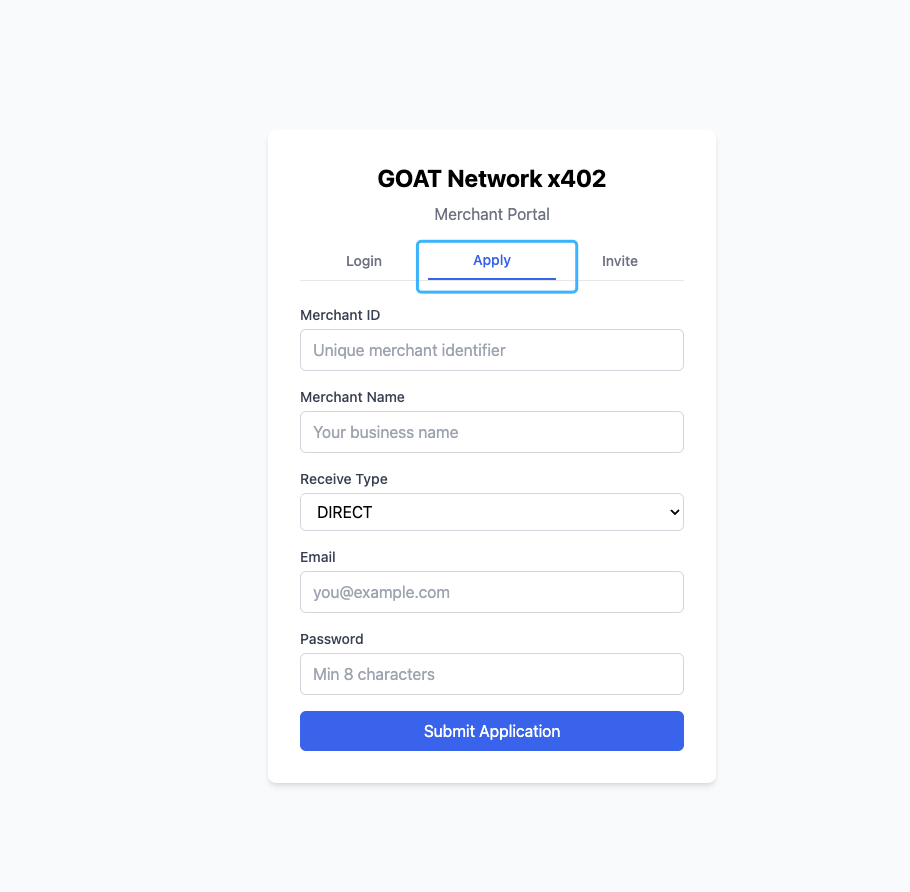

### 3.2 Fill in Registration Details

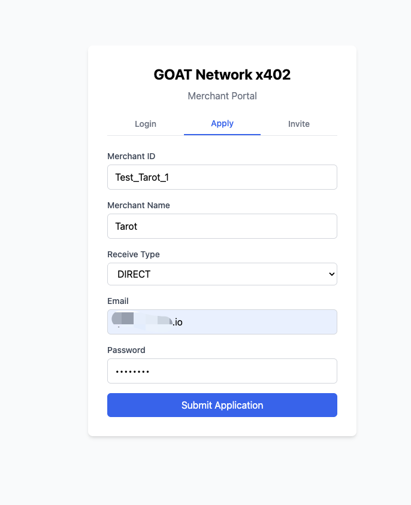

Fill in the following fields:

| Field | Description | Format Requirements |
|-------|-------------|---------------------|
| **Merchant ID** | Unique merchant identifier, cannot be changed after registration | Letters, numbers, and underscores only. **No spaces allowed.** Example: `Test_1`, `My_Shop_01` |
| **Merchant Name** | Display name, can be changed later | Any text |
| **Receive Type** | Payment mode | Select `DIRECT` or `DELEGATE` from dropdown (see Section 2) |
| **Email** | Login email | Valid email address |
| **Password** | Login password | Recommended: 8+ characters with letters and numbers |

> ⚠️ **Merchant ID Format:** Only English letters, numbers, and underscores (`_`) are allowed. **No spaces or special characters.** Examples: `Tarot_App`, `GameStore_01`. Cannot be changed once registered.

### 3.3 Submit Application

Click **Submit Application** when done.

After submission, the system will display "Waiting for admin approval." You cannot log in until approved. Attempting to log in will show: "merchant account is pending approval."

---

## 4. Approval & Login

### 4.1 Admin Approval

After registration, a GOAT x402 administrator will review your application, typically within 24 hours. You will be notified once approved.

### 4.2 Login

Once approved, open the Merchant Portal and switch to the **Login** tab.

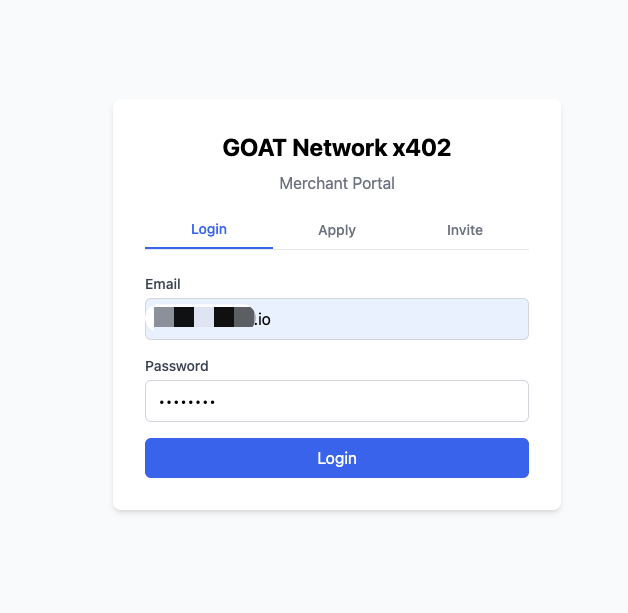

Enter the email and password you used during registration, then click **Login** to access the dashboard.

---

## 5. Dashboard Overview

After login, you'll land on the Dashboard page.

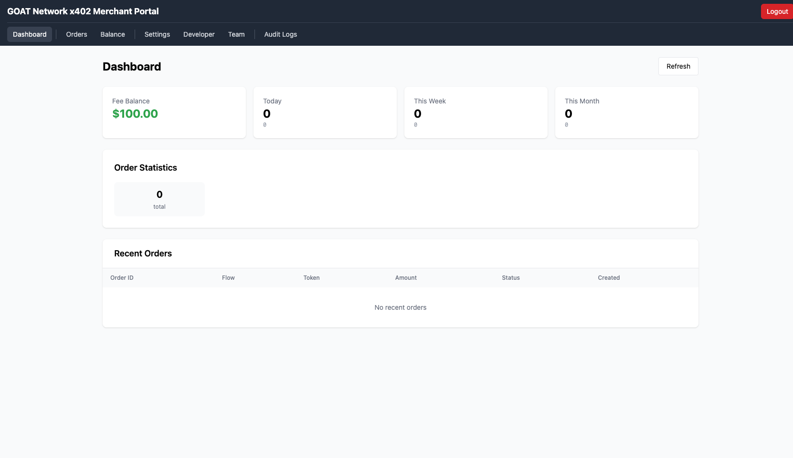

The Dashboard displays:

| Card | Description |
|------|-------------|
| **Fee Balance** | Current fee balance (for platform transaction fees) |
| **Today** | Today's order count and volume |
| **This Week** | This week's order count and volume |
| **This Month** | This month's order count and volume |

Below the cards:
- **Order Statistics** — Total order count
- **Recent Orders** — Latest orders list

New merchants will show all zeros — this is normal.

---

## 6. Configure Receiving Addresses

Go to the **Settings** page and find the **Receiving Addresses** section.

### 6.1 Initial State

New merchants have no receiving addresses configured.

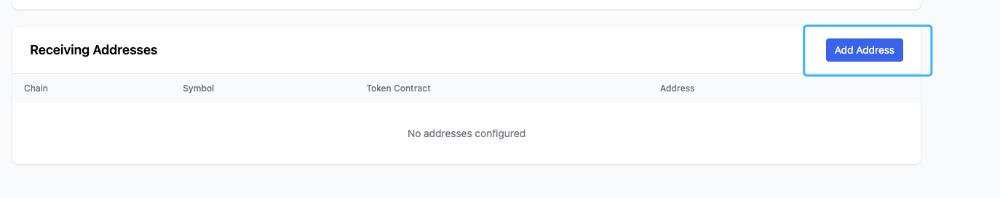

### 6.2 Add a Receiving Address

Click **Add Address** in the top right to open the form.

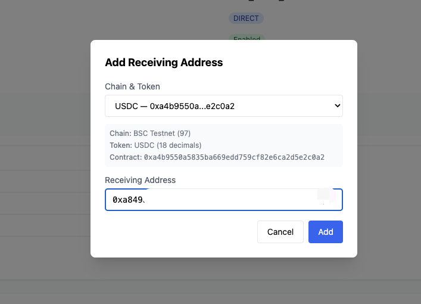

Fill in:

| Field | Description |
|-------|-------------|
| **Chain** | Select a chain (e.g., GOAT Testnet3, BSC Testnet) |
| **Token** | Select a token (e.g., USDC, USDT) |
| **Address** | Your EVM receiving address (`0x` + 40 hex characters) |

> ⚠️ **Important:**
> - Each Chain + Token combination can only have one address — duplicates will be rejected
> - Address must be a valid EVM address (`0x` + 40 hex)
> - Available chain and token configuration depends on the merchant setup and current platform support matrix

### 6.3 View Added Addresses

After adding, addresses appear in the list.

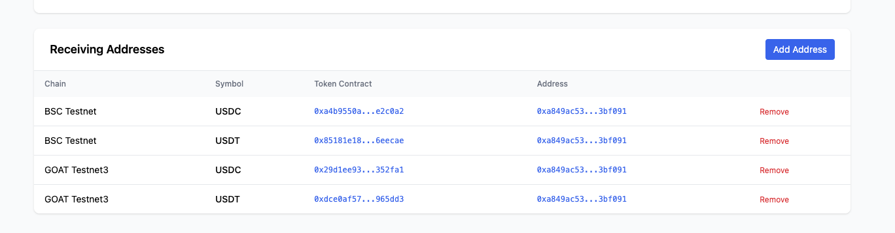

The list shows each address's chain, token, token contract, and receiving address. Click **Remove** (red text) to delete an address.

---

## 7. Merchant Settings

Go to the **Settings** page to view and edit merchant information.

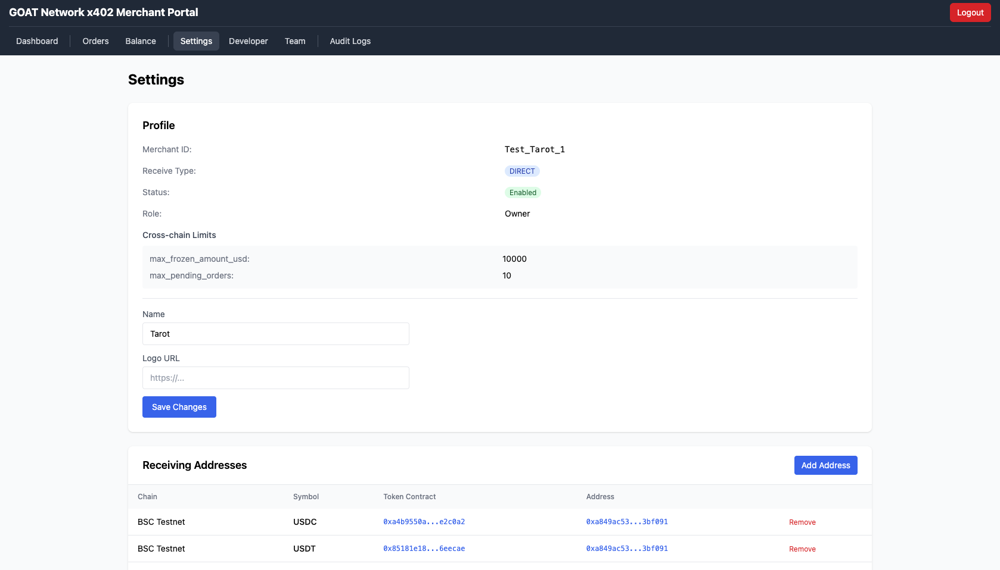

### Profile Information

| Field | Editable | Description |
|-------|----------|-------------|
| Merchant ID | ❌ Read-only | Set during registration |
| Receive Type | ❌ Read-only | DIRECT or DELEGATE |
| Status | ❌ Read-only | Enabled / Disabled |
| Role | ❌ Read-only | Owner or Member |
| Name | ✅ Editable | Merchant display name |
| Logo URL | ✅ Editable | Merchant logo image URL |

Click **Save Changes** after modifications.

### Cross-chain Limits

The Settings page also displays cross-chain limit configuration:

- `max_frozen_amount_usd` — Maximum frozen amount (USD)
- `max_pending_orders` — Maximum pending orders

These limits are set by Admin and cannot be modified by merchants.

---

## 8. API Keys Management

Go to the **Developer** page to view and manage API keys.

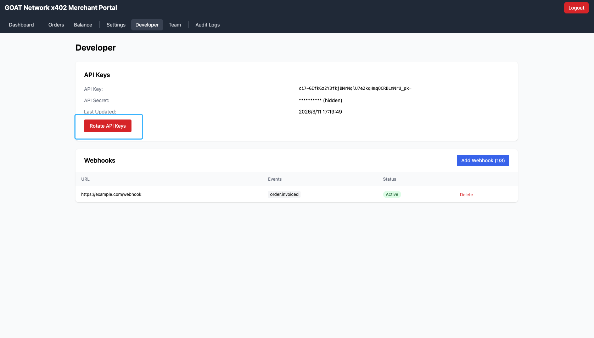

### After Rotation

After clicking **Rotate API Keys**, the system generates new keys and displays a prompt. The API Key and API Secret are only shown in full at this moment — save them immediately.

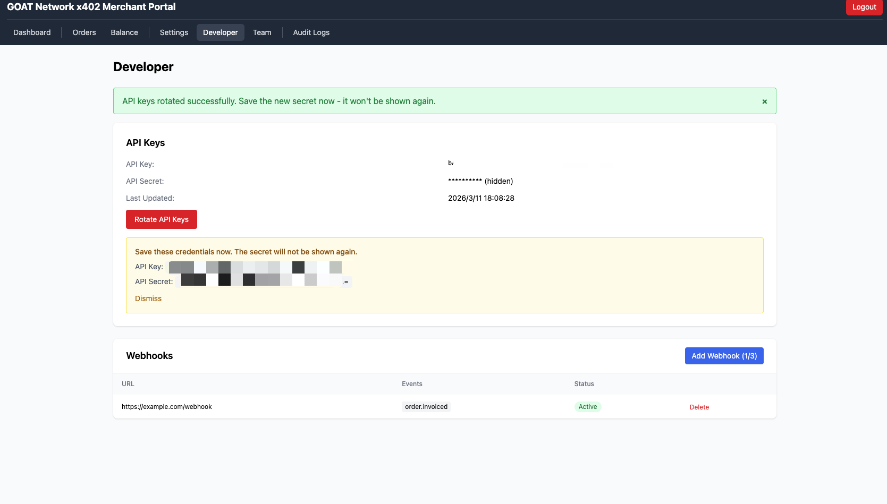

### API Keys Fields

| Field | Description |
|-------|-------------|
| **API Key** | Public key for identifying your merchant |
| **API Secret** | Private key for HMAC signature verification. **Shown only once when generated** |
| **Last Updated** | Last rotation timestamp |

### Instructions

1. On first visit, click **Rotate API Keys** to generate keys
2. **Save the API Secret immediately** — it's only shown once
3. Clicking Rotate again generates new keys — **old keys are invalidated immediately**
4. Use the API Key and API Secret in your backend SDK configuration:

```
GOATX402_API_KEY=your_API_Key
GOATX402_API_SECRET=your_API_Secret
```

> ⚠️ **Security Warning:**
> - API Secret belongs on the backend only — **never expose it in frontend code or public repositories**
> - If you suspect a key leak, Rotate immediately to generate new keys

---

## 9. Webhook Configuration

Webhooks notify you when order statuses change. When an order status updates, the system sends a POST request to your configured URL.

### 9.1 Add a Webhook

On the Developer page, click **Add Webhook**.

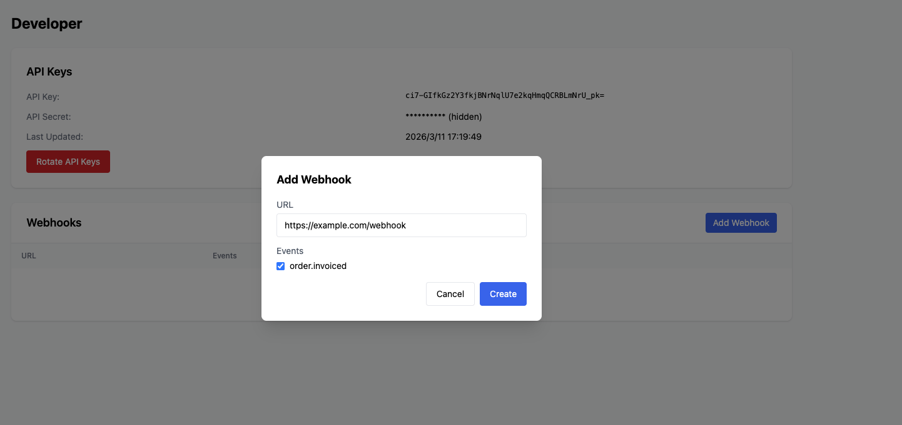

| Field | Description |
|-------|-------------|
| **URL** | Your callback URL. **Must be HTTPS.** Example: `https://your-app.com/api/x402/callback` |
| **Events** | Check the events to subscribe to. Currently supports `order.invoiced` (order settled) |

> ⚠️ **Restrictions:**
> - URL must be HTTPS — HTTP is not supported
> - `localhost` URLs are not allowed (SSRF protection)
> - Maximum **3 webhooks** per merchant

### 9.2 Save the Webhook Secret

After creation, the system displays the **Webhook Secret**.

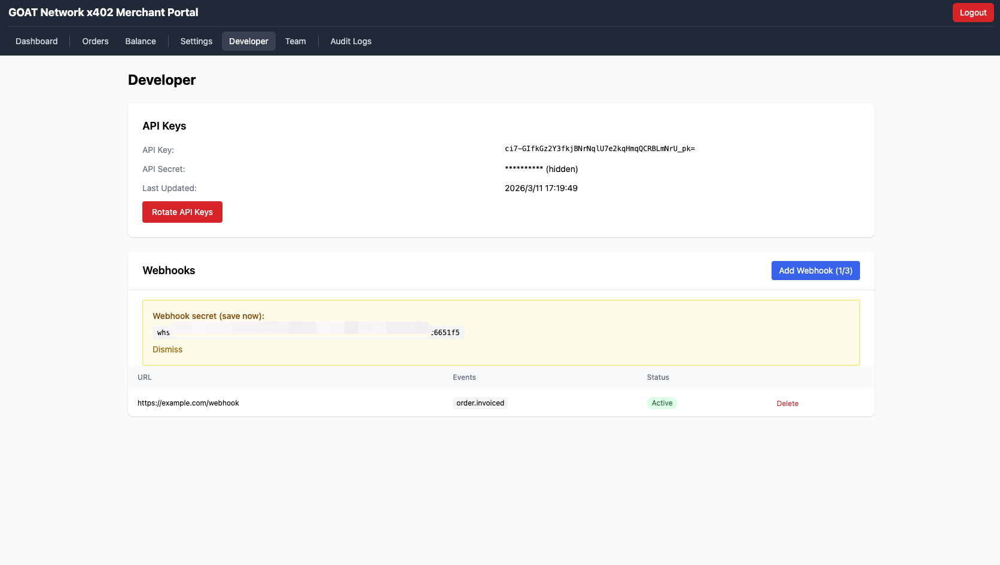

> ⚠️ **The Webhook Secret is shown only once!** Copy and save it immediately. It's used to verify that incoming webhook requests are genuinely from the GOAT x402 system and prevent forgery.

### 9.3 Manage Webhooks

After creation, you can see each webhook's URL, Events, and status (Active/Disabled) in the list. You can:

- **Edit** — Change URL or toggle enabled/disabled
- **Delete** — Remove the webhook

---

## 10. Team Management & Invite Codes

Merchant Owners can invite others to join the team. Invited members have **read-only access** — they can view Dashboard, Orders, and Balance, but **cannot modify** any merchant configuration.

### 10.1 Role Permission Comparison

| Feature | Owner | Member |
|---------|-------|--------|
| View Dashboard | ✅ | ✅ |
| View Orders | ✅ | ✅ |
| View Balance | ✅ | ✅ |
| Modify Settings (Profile, Addresses, etc.) | ✅ | ❌ |
| Manage API Keys | ✅ | ❌ |
| Manage Webhooks | ✅ | ❌ |
| Manage Team / Invite Codes | ✅ | ❌ |
| View Audit Logs | ✅ | ✅ |

> Members will **not see the Team menu** in the navigation bar and cannot see any edit buttons for receiving addresses.

### 10.2 Create an Invite Code (Owner)

Go to the **Team** page and click **Create Invite Code**.

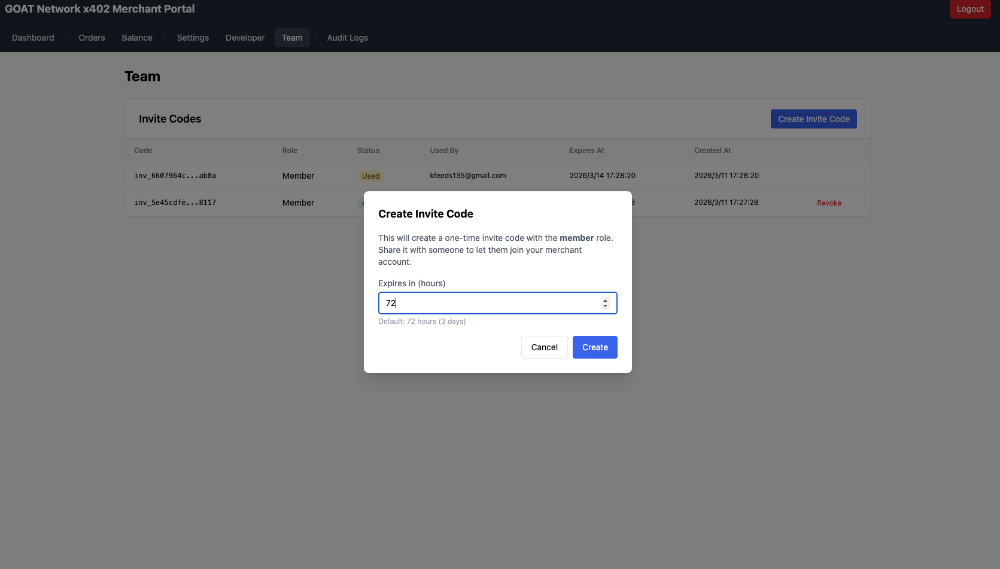

- Invite code role is fixed as **Member**
- Expiration defaults to **72 hours** (3 days), adjustable
- Each invite code is **single-use only**

### 10.3 Copy the Invite Code

After creation, the system displays the full invite code.

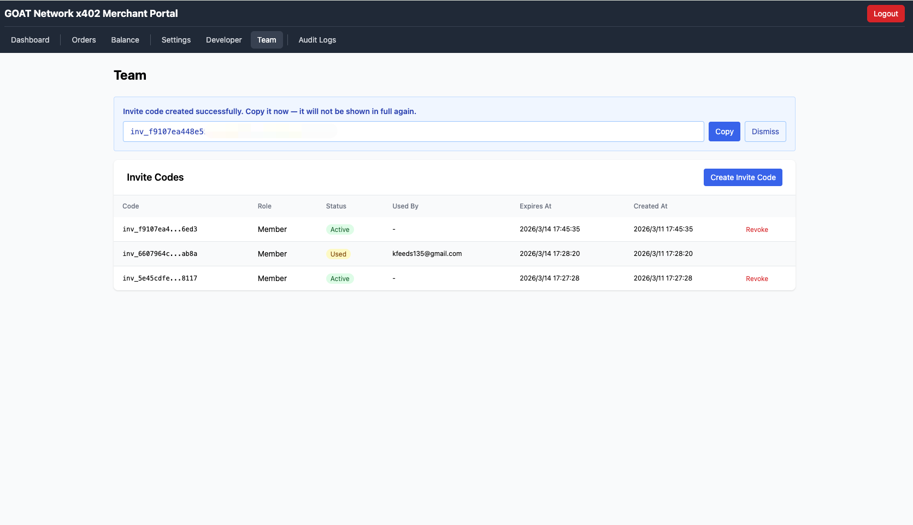

> ⚠️ **The full invite code is shown only once!** Click **Copy** immediately and share it with the invitee.

### 10.4 Invite Code Status Management

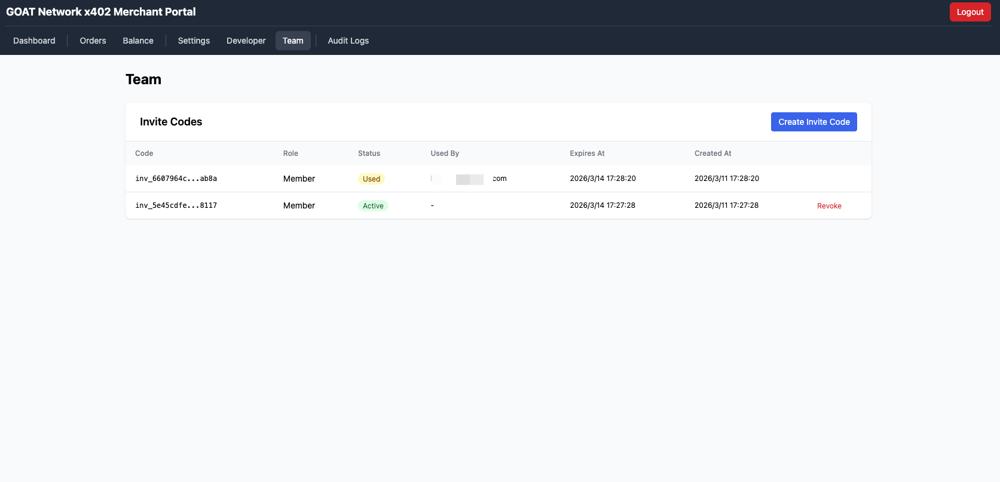

Invite codes have three possible statuses:

| Status | Description |
|--------|-------------|
| **Active** (green) | Unused, can be shared. Owner can click **Revoke** to cancel |
| **Used** (blue) | Already used, shows the user's email |
| **Revoked** | Cancelled, can no longer be used |

### 10.5 Invitee Registration (Member)

The invitee opens the Merchant Portal and switches to the **Invite** tab.

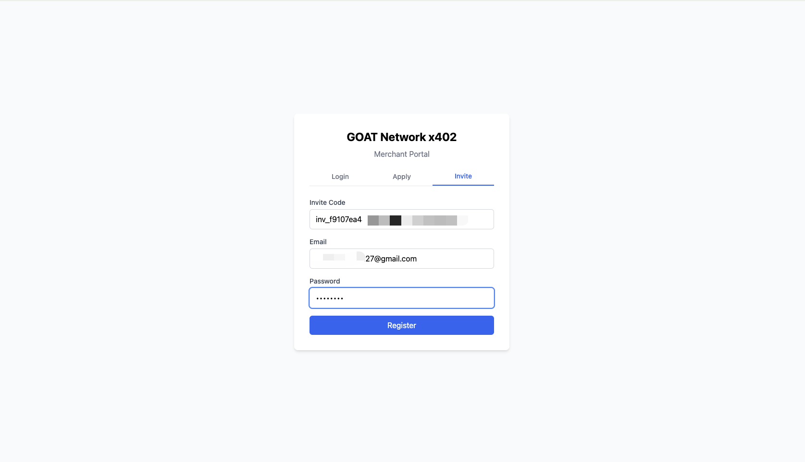

Fill in:
- **Invite Code** — The code provided by the Owner
- **Email** — Your own email
- **Password** — Set a login password

Click **Register** to complete registration. Invite code registration **does not require Admin approval** — you can log in immediately after registration.

### 10.6 Member After Login

Members can see Dashboard, Orders, Balance, and other pages, but the navigation bar has no Team menu and no edit buttons are visible for any configuration.

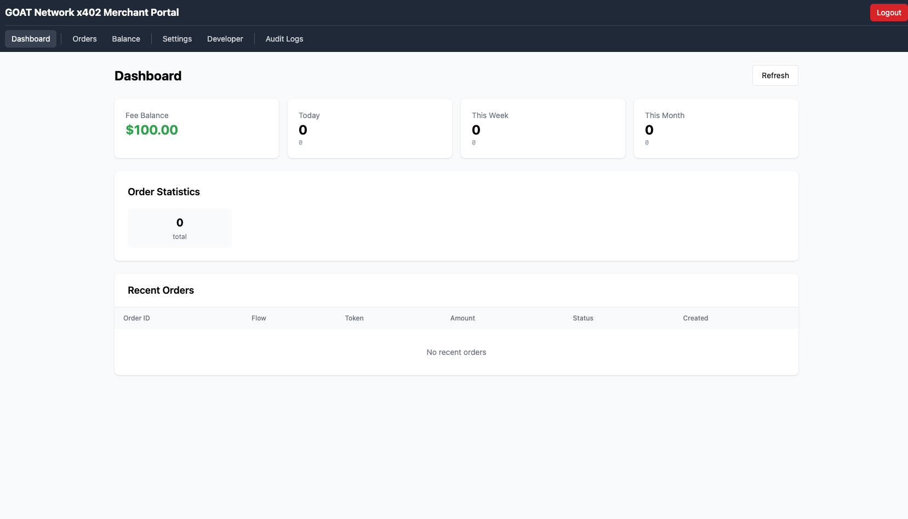

---

## 11. Order Management

Go to the **Orders** page to view all orders.

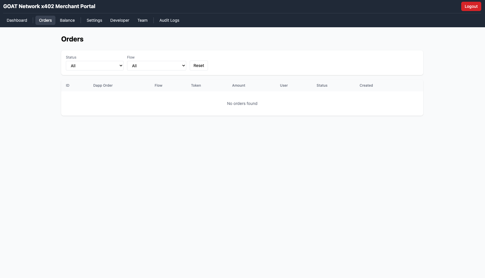

### Filters

| Filter | Options |
|--------|---------|
| **Status** | All / Various order statuses |
| **Flow** | All / DIRECT / DELEGATE |

Click **Reset** to clear all filters.

### Order List Fields

| Column | Description |
|--------|-------------|
| ID | System order ID |
| Dapp Order | DApp-side order number |
| Flow | DIRECT or DELEGATE |
| Token | Payment token (e.g., USDC) |
| Amount | Payment amount |
| User | Payer's address (blue link, click to view on Explorer) |
| Status | Order status |
| Created | Creation time |

Click **View** to see order details, including on-chain Payment and Payout transaction information.

---

## 12. Balance & Fees

Go to the **Balance** page to view fee-related information.

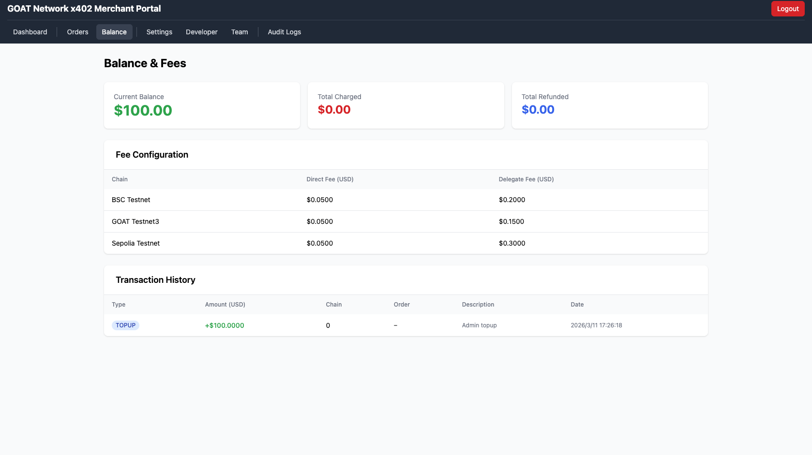

### What is Fee Balance?

Fee Balance is your **prepaid platform fee balance**. For each payment completed through x402, the system automatically deducts the corresponding fee from your Fee Balance. When the balance is insufficient, new payment requests cannot be processed.

### How to Top Up?

After your merchant registration is approved, contact the GOAT x402 team to complete your initial top-up:

1. **Contact the GOAT x402 team** with your Merchant ID
2. **Agree on a top-up amount** — the team will recommend an amount based on your business estimate
3. **After payment**, Admin will top up your account in the backend
4. Once credited, the Balance page will show your updated balance, and Transaction History will show a TOPUP record

> 💡 **Testnet:** On testnet, Admin directly credits approved merchants with a test balance (e.g., $100) — no actual payment required.
>
> 💡 **Mainnet:** On mainnet, top-ups are also handled by Admin. Please contact the GOAT x402 team.

### Balance Cards

| Card | Description |
|------|-------------|
| **Current Balance** | Current fee balance (green) — auto-deducted per order |
| **Total Charged** | Cumulative fees charged (red) — total historical fees |
| **Total Refunded** | Cumulative refunds (blue) — fees returned from order refunds |

### Fee Configuration

Per-order fee amounts for each chain:

| Chain | DIRECT Fee | DELEGATE Fee |
|-------|-----------|--------------|
| BSC Testnet | $0.0500 | $0.2000 |
| GOAT Testnet3 | $0.0500 | $0.1500 |
| Sepolia Testnet | $0.0500 | $0.3000 |

> Fees are set by Admin. DELEGATE fees are higher than DIRECT because they include cross-chain routing, Gas sponsorship, and callback execution services.

### Transaction History

Lists all fee-related transactions:

| Type | Description |
|------|-------------|
| **TOPUP** | Top-up records (Admin operation) |
| **CHARGE** | Order fee deductions |
| **REFUND** | Refund returns |

---

## 13. Audit Logs

Go to the **Audit Logs** page to view all operation records.

The system automatically records the following operations:

- Profile changes (name, logo)
- Receiving address additions and removals
- Webhook creation, editing, and deletion
- API Key rotations
- Invite code creation and revocation
- Login and logout

Each record contains:

| Field | Description |
|-------|-------------|
| Action | Operation type |
| Old Value | Value before change |
| New Value | Value after change |
| Actor | Who performed the action |
| IP | Actor's IP address |
| Time | When the action occurred |

---

## Appendix: Quick Start Checklist

Complete the following steps to start accepting payments:

- [ ] 1. Register a merchant account (choose DIRECT or DELEGATE mode)
- [ ] 2. Wait for Admin approval
- [ ] 3. Log in to the portal
- [ ] 4. Add receiving addresses (at least one Chain + Token)
- [ ] 5. Generate API Keys and save the API Secret
- [ ] 6. Configure webhook callback URL
- [ ] 7. Integrate x402 SDK in your DApp backend

```bash
# Install SDK
npm install goatx402-sdk goatx402-sdk-server

# Backend configuration
GOATX402_API_URL=https://x402-api.goat.network
GOATX402_API_KEY=your_API_Key
GOATX402_API_SECRET=your_API_Secret
```

---

> For questions, please contact the GOAT Network team.

---

Contact email: x402support@goat.network
