# GOAT Flow Merchant Guide

Use this guide to register a merchant, configure receiving addresses and
developer access, manage orders and team members, and publish QuickPay products
or paid API routes.

---

## Table of Contents

1. [Overview](#1-overview)
2. [Payment Mode and Available Assets](#2-payment-mode-and-available-assets)
3. [Register a Merchant Account](#3-register-a-merchant-account)
4. [Approval, Login, and Account Security](#4-approval-login-and-account-security)
5. [Dashboard Overview](#5-dashboard-overview)
6. [Configure Receiving Addresses](#6-configure-receiving-addresses)
7. [Merchant Settings](#7-merchant-settings)
8. [API Keys Management](#8-api-keys-management)
9. [Webhook Configuration](#9-webhook-configuration)
10. [Team Management and Invite Codes](#10-team-management-and-invite-codes)
11. [Order Management](#11-order-management)
12. [QuickPay and Products](#12-quickpay-and-products)
13. [Balance, Fees, and Top-up](#13-balance-fees-and-top-up)
14. [Audit Logs](#14-audit-logs)

---

## 1. Overview

The GOAT Flow Merchant Portal is your management dashboard for registering your
merchant identity, configuring receiving addresses, managing the team, keys, and
webhooks, viewing orders and balances, and publishing QuickPay and agent (MPP)
commerce surfaces.

### Portal navigation

The portal sidebar is grouped as:

| Group | Pages |
| --- | --- |
| **Overview** | Dashboard |
| **Payments** | Orders · Order Reconciliation |
| **Payment Setup** | Receiving Tokens & Addresses · Hosted Checkout (QuickPay) · QuickPay Products · Paid API Routes (MPP) |
| **Billing** | Fee Balance · Fee Top-up |
| **Developer** | Programmatic API & Webhooks |
| **Account & Security** | Profile · Team · Security · Audit Logs |

Use the service origins for the target environment:

- Merchant Portal: `https://flow-merchant.goat.network` (Testnet3:
  `https://flow-merchant.testnet3.goat.network`)
- Admin Portal (authorized operators only): `https://flow-admin.goat.network`
  (Testnet3: `https://flow-admin.testnet3.goat.network`)
- Flow API / standalone MPP Core: `https://flow-api.goat.network` (Testnet3:
  `https://flow-api.testnet3.goat.network`)
- QuickPay / Checkout and same-origin public API: `https://flow-quickpay.goat.network` (Testnet3:
  `https://flow-quickpay.testnet3.goat.network`)

The QuickPay client derives public session and MPP paths from the
trusted QuickPay link origin. Use `flow-api` for authenticated merchant APIs
and for standalone MPP only when that Core origin is explicitly configured.

### Before you begin

- Keep Mainnet and Testnet3 merchant IDs, credentials, wallets, webhook secrets,
  receiving addresses, and configuration separate.
- Use the active portal, manifest, challenge, or API response as the source of
  current configuration.
- Never share API secrets, webhook secrets, private keys, TOTP setup data,
  recovery codes, active invite codes, or unredacted personal and wallet data.

---

## 2. Payment Mode and Available Assets

The current buyer and server SDKs implement DIRECT transfer workflows in which
the payer sends ERC-20 tokens to the receiving address returned for the order.
The current GOAT Flow MPP profile also uses a direct-transfer and
receipt-verification flow; MPP itself is not limited to this payment method.

- Fund flow: User wallet -> Merchant wallet
- Mechanism: ERC-20 `transfer`
- Best for: Tips, donations, simple checkout, QuickPay links, and agent (MPP) purchases
- Requirements: A receiving address for each supported chain/token pair
- Records: Confirmed orders can expose a server-issued payment record for
  operations and reconciliation

**Example:** A content service configures a GOAT Mainnet USDC receiving address.
A buyer sends USDC to that same-chain merchant address, and GOAT Flow observes
and matches the transfer to the order.

This guide covers DIRECT, the current public merchant mode.

### Find available chains and tokens

Do not treat a static chain matrix as current availability.
Supported chains, tokens, decimals, contracts, minimums, maximums, and available
transfer and receipt capabilities are deployment- and merchant-specific.

Use these runtime sources:

- **Portal:** Receiving Tokens & Addresses, QuickPay accepted tokens, and MPP route
  selectors.
- **Public integration:** the x402 challenge, QuickPay `manifest.json`, or public
  merchant lookup.
- **Authenticated integration:** order and checkout responses returned by the
  active API deployment.

Testnet3 configuration does not imply that the same chains, token contracts,
limits, fees, or merchant capabilities are enabled on Mainnet.

---

## 3. Register a Merchant Account

### 3.1 Open the Registration Page

Visit the Merchant Portal and select **Apply** to open the registration form.

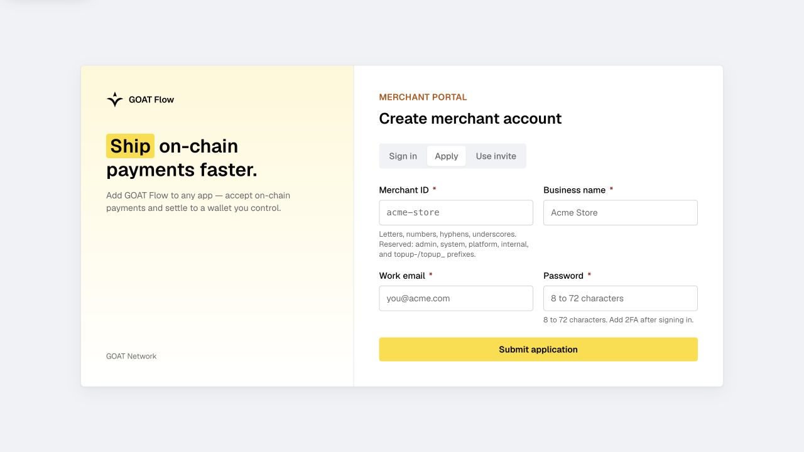

### 3.2 Fill in Registration Details

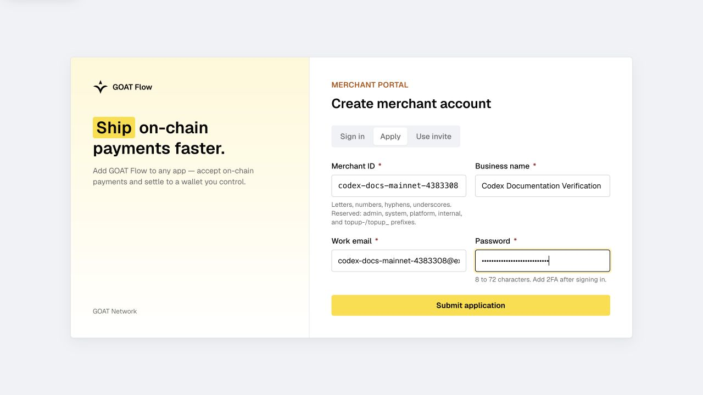

The registration form includes:

| Field | Description | Format Requirements |
| --- | --- | --- |
| **Merchant ID** | Unique merchant identifier; cannot be changed after registration | Letters, numbers, hyphens, and underscores only. Reserved IDs and `topup-` / `topup_` prefixes are not available. |
| **Business name** | Display name; can be changed later | Any merchant display text |
| **Work email** | Owner login email | Valid email address |
| **Password** | Owner login password | 8 to 72 characters. Set up 2FA after signing in. |

### 3.3 Submit Application

Click **Submit application** when done.

After submission, the portal displays:

> Registration submitted. Your account will be available after admin approval.
> No access token or session is issued until then.

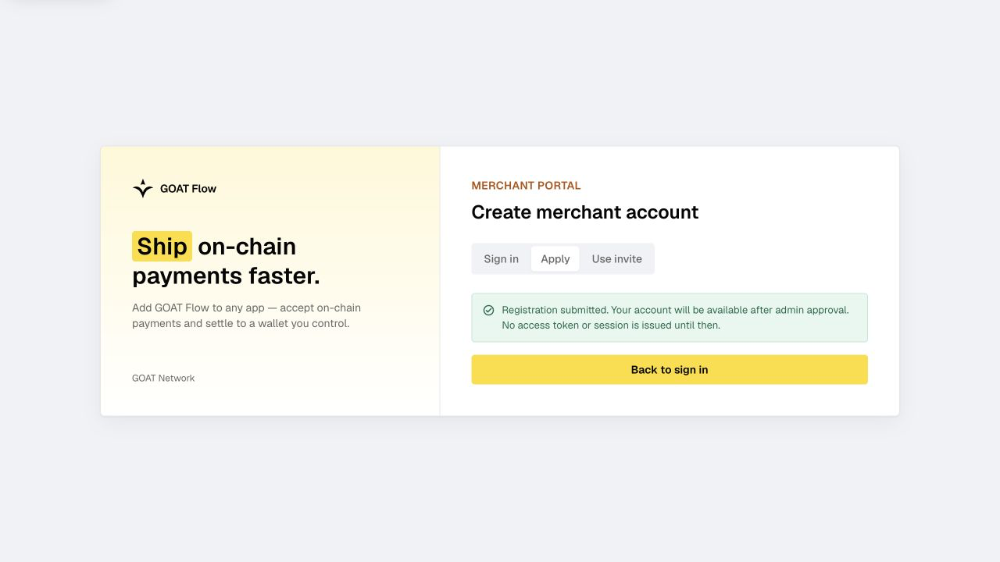

The applicant is not signed in and no access or refresh session is issued until
the application is approved. The GOAT Flow operations team performs the approval
and activates the owner account.

---

## 4. Approval, Login, and Account Security

### 4.1 Admin Approval

After registration, a GOAT Flow administrator reviews the application. Approval
enables the merchant account. QuickPay and MPP are separate capabilities;
inspect **Profile** or the relevant setup page to see whether they are enabled
for the account.

### 4.2 Login

The portal provides **Sign in**, **Apply**, and **Use invite** tabs.

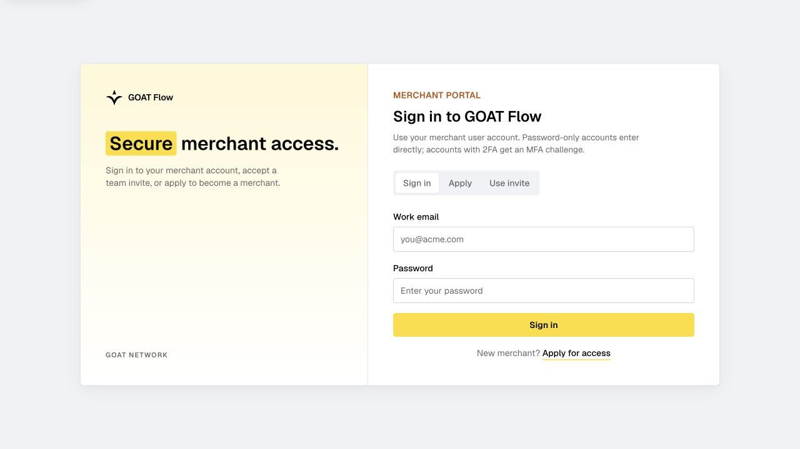

Once approved, enter the work email and password used during registration. If
2FA is enabled, complete the TOTP or recovery-code challenge before entering the
dashboard.

If login fails, the generic `invalid email or password` response does not
distinguish an invalid credential from an activation or account-state problem.
If the credentials are correct but access still fails, contact
[Support@goat.network](mailto:Support@goat.network) to confirm the account state
or request a reset.

### 4.3 Change Password

Every authenticated owner or member can open **Account & Security → Security**
and select **Change password**. The form requires:

- current password
- new password
- confirmation of the new password

The new password must be 8 to 72 characters and must differ from the current
password.

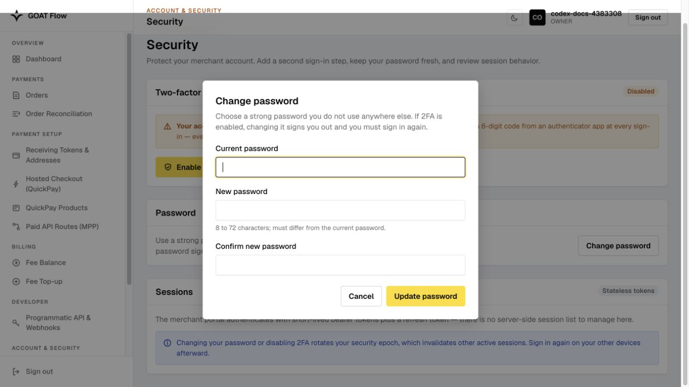

Lockout thresholds and administrator reset policies can vary. Contact support if
self-service recovery is unavailable.

### 4.4 Self-Service 2FA

2FA is **per user and not owner-gated**. Enroll, confirm, or disable TOTP on the
**Account & Security → Security** page. The account is password-only until 2FA
is enabled; after that, every sign-in requires a 6-digit authenticator code.

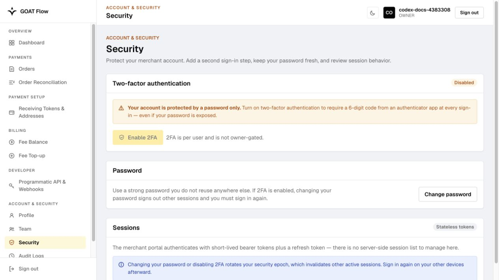

Store recovery codes securely. They are meant for account recovery if the authenticator is unavailable.

Do not publish screenshots of the enrollment QR code, shared secret, or recovery
codes.

### 4.5 Lost Password or Authenticator

If you lose your password or 2FA authenticator and
cannot recover with a one-time recovery code, contact the GOAT Flow operations
team at [Support@goat.network](mailto:Support@goat.network).

### 4.6 Sessions

Portal sessions use short-lived access tokens with refresh sessions. After a
password or 2FA change, sign out other sessions where possible and sign in again.
Do not rely on a fixed session-expiry or invalidation delay.

---

## 5. Dashboard Overview

After login, the owner lands on the Dashboard page.

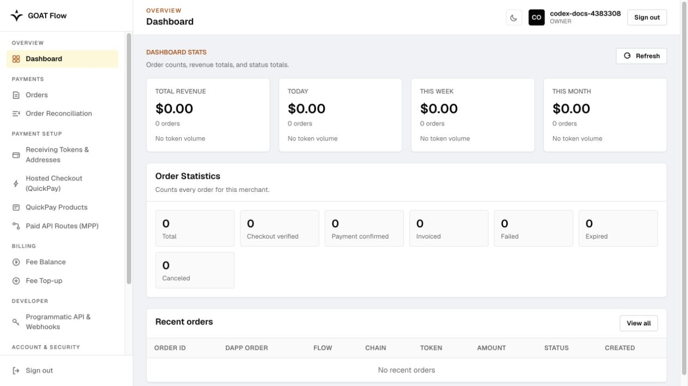

### 5.1 Setup progress

Until the required DIRECT setup is complete, the Testnet3 Dashboard shows a
setup card with four checks:

- Account enabled
- DIRECT mode confirmed
- Receiving address configured
- API keys reviewed as an optional step

Select **Resume setup** to open **Payment Setup → Onboarding**.

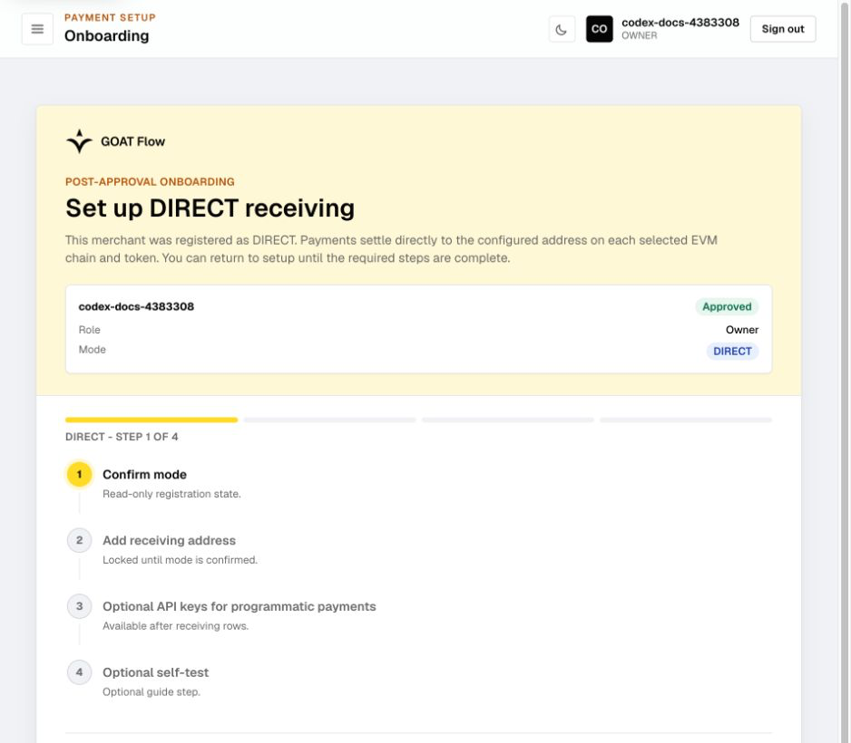

The current DIRECT onboarding flow has four steps:

1. Confirm the read-only receive mode.
2. Add one or more receiving rows.
3. Optionally create API keys for programmatic DIRECT transfer workflows.
4. Review the optional self-test.

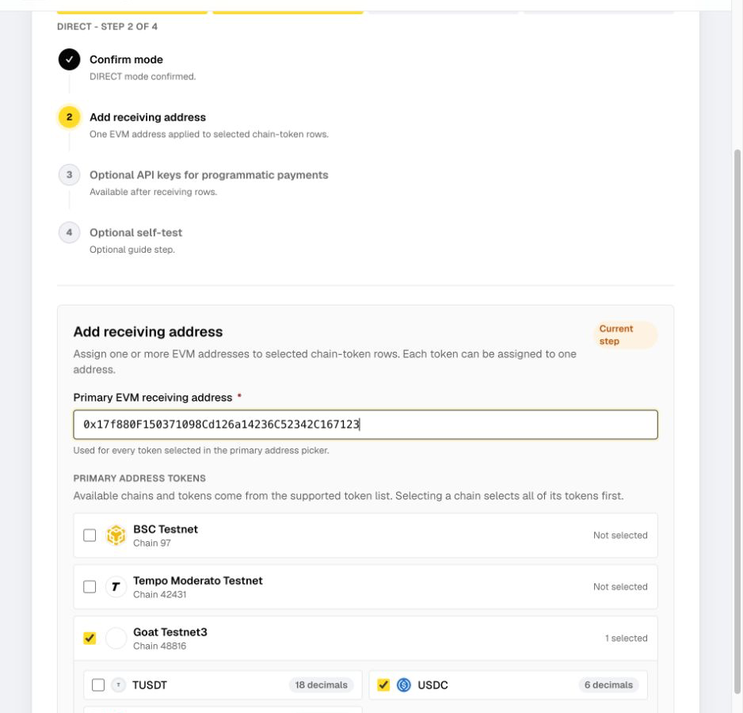

The self-test is guidance, not an approval gate. A merchant can return to the
Dashboard without broadcasting a payment.

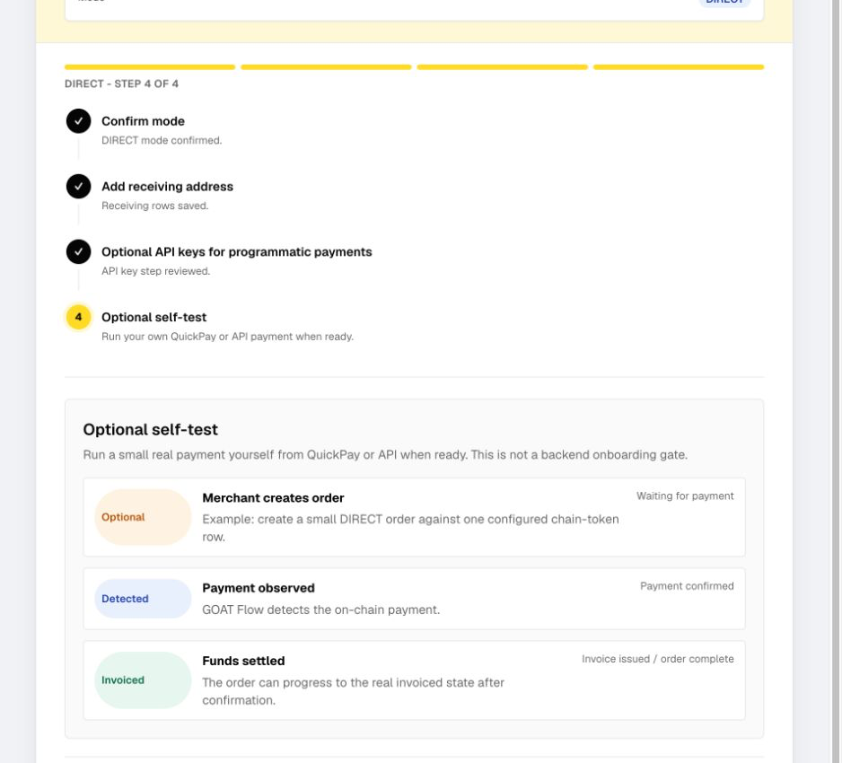

### 5.2 Dashboard statistics

**Dashboard Stats** show revenue and order totals as cards:

| Card | Description |
| --- | --- |
| **Total Revenue** | Cumulative order revenue and order count |
| **Today** | Today's order count and volume |
| **This Week** | This week's order count and volume |
| **This Month** | This month's order count and volume |

**Order Statistics** counts every order by state: Total, Checkout verified, Payment
confirmed, Invoiced, Failed, Expired, Canceled. A **Recent orders** table lists the
latest orders (Order ID, Dapp Order, Flow, Chain, Token, Amount, Status, Created).

New merchants show zero counts until orders are created and paid.

---

## 6. Configure Receiving Addresses

Open **Payment Setup → Receiving Tokens & Addresses** in the sidebar.

In DIRECT, the buyer wallet sends tokens to the merchant
wallet address returned for the order on the selected EVM chain.

### 6.1 Add a Receiving Address

Click **Add address** in the top right to open the form. Token options come from
the supported token list, filtered to EVM and already-configured pairs.

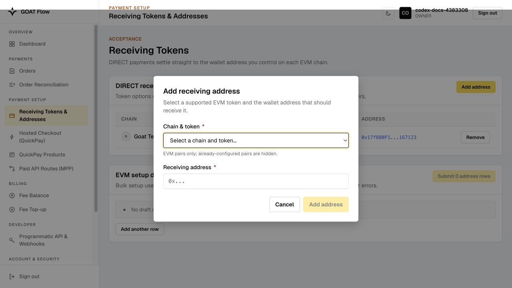

The **DIRECT receiving addresses** table lists one row per accepted pair:

| Column | Description |
| --- | --- |
| **Chain** | One of the EVM chains offered by the active deployment |
| **Symbol** | Token symbol, such as USDC or USDT |
| **Token contract** | The token's ERC-20 contract address |
| **Address** | Your EVM receiving address (`0x` + 40 hex characters) |

The form enforces these rules:

- Each Chain + Token combination can only have one address.
- Address and token contract must be valid EVM addresses.
- Available chains/tokens come from deployment configuration.
- The onboarding picker initially selects all available test rows; review the
  selection before confirming so that one address is not unintentionally assigned
  to every chain and token.

To configure several pairs at once, use the **EVM setup draft** panel: add rows,
then select **Submit**. Each row is submitted independently and reports its own
success or error state; review every row before continuing.

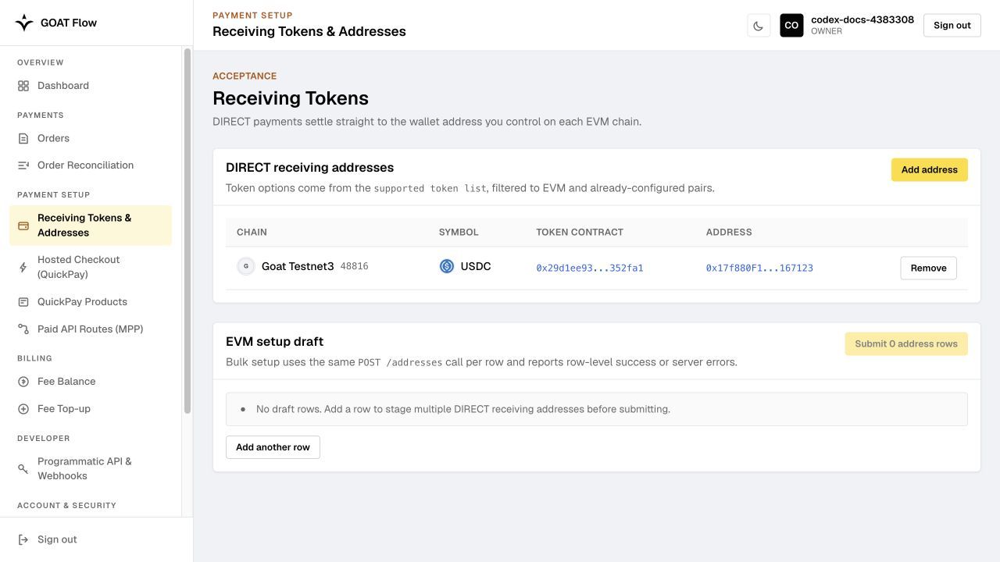

---

## 7. Merchant Settings

Open **Account & Security → Profile** to view your merchant identity and edit
business details. Receive type and merchant ID are read-only.

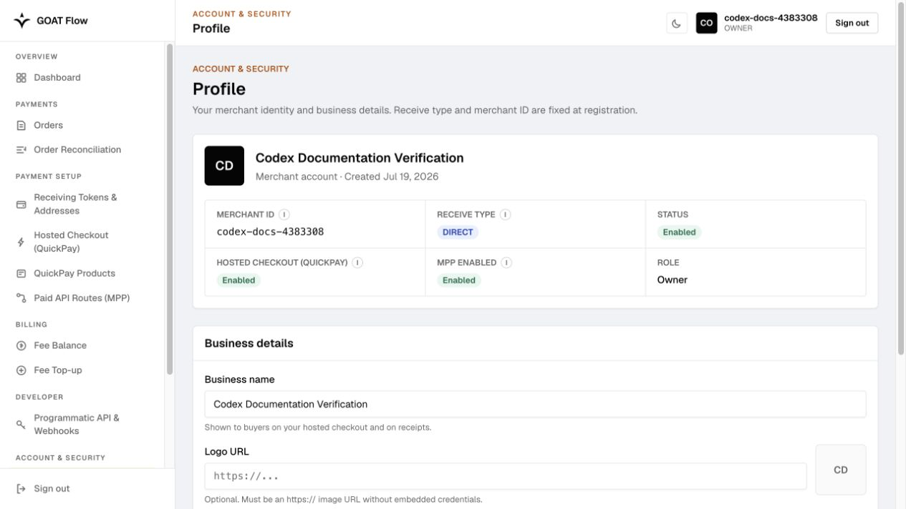

### Identity and capability flags

The account card shows fixed identity and capability fields:

| Field | Editable | Description |
| --- | --- | --- |
| Merchant ID | No | Set during registration |
| Receive type | No | `DIRECT`; fixed at registration |
| Status | No | Enabled / Disabled |
| Hosted Checkout (QuickPay) | No | Whether QuickPay is enabled for this merchant |
| MPP enabled | No | Whether Paid API Routes (MPP) are enabled |
| Role | No | Owner or Member |

### Business details

| Field | Editable | Description |
| --- | --- | --- |
| Business name | Yes | Shown to buyers on your hosted checkout and on receipts |
| Logo URL | Yes | Optional; must be an `https://` image URL without embedded credentials |

Click **Save changes** after modifications.

### Per-chain payment limits

The **Per-chain payment limits** panel is **read-only**.
These are merchant-level per-chain limits set by GOAT Flow risk controls and
shown for reference (for example `max_frozen_amount_usd`,
`max_pending_orders`).

---

## 8. API Keys Management

API keys and webhooks share **Developer → Programmatic API & Webhooks**. API keys
are **optional** and are only needed for programmatic DIRECT transfer workflows.
Hosted QuickPay works without API keys.

New Testnet3 merchants show `API key (not set)` / `API secret (not set)` until an owner
creates keys. The existing API secret is never returned after creation.

### Create or rotate API keys

After selecting **Rotate API Keys**, GOAT Flow generates a new API Key and API
Secret. The secret is shown only once; save it immediately.

| Field | Description |
| --- | --- |
| **API Key** | Public key for identifying your merchant |
| **API Secret** | Private HMAC key; shown only once when generated |
| **Last Updated** | Last rotation timestamp |

After the one-time display closes, the Developer page still shows the API Key but
only reports that the Secret is configured. Do not include either credential in
screenshots, tickets, or public documentation.

Use API keys only from your backend:

```bash
GOATX402_API_URL=https://flow-api.goat.network
GOATX402_API_KEY=your_API_Key
GOATX402_API_SECRET=your_API_Secret
```

The TypeScript and Go server SDKs sign authenticated `/api/v1/*` requests with:

| Header | Required |
| --- | --- |
| `X-API-Key` | Yes |
| `X-Timestamp` | Yes |
| `X-Nonce` | Yes |
| `X-Sign` | Yes |

Do not expose the API Secret in frontend code or public repositories. If you
suspect a key leak, rotate it immediately and confirm the previous credentials
no longer work.

---

## 9. Webhook Configuration

Webhooks are configured on the same **Programmatic API & Webhooks** page, below
API keys. The current portal allows up to **3 webhooks**.

### 9.1 Add a Webhook

On the Developer page, click **Add webhook**.

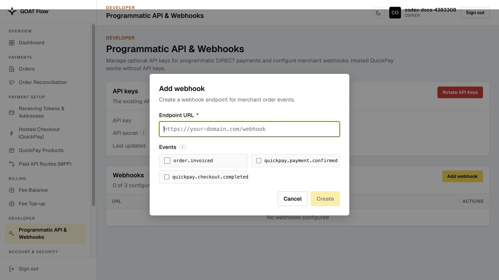

| Field | Description |
| --- | --- |
| **URL** | Your callback URL. Must be HTTPS. Example: `https://your-app.com/api/x402/callback` |
| **Events** | Events exposed by the active deployment |

The form enforces:

- URL must be HTTPS.
- `localhost` URLs are not allowed.
- Maximum 3 webhooks per merchant.

The Testnet3 portal currently shows
`order.invoiced`, `quickpay.payment.confirmed`, and
`quickpay.checkout.completed`. Available events can vary by environment and are
not defined by the public SDK packages.

> **Before relying on a webhook:** confirm the event is emitted in the target
> environment and verify its payload schema, signature input and headers,
> timestamp and replay rules, retry schedule, and delivery source.

Before enabling fulfillment:

1. Deploy a publicly reachable HTTPS endpoint with a valid certificate.
   `localhost`, private-only addresses, browser cookies, and interactive login
   are not valid delivery dependencies.
2. Preserve the raw request bytes until signature verification is complete if the
   deployment signs the raw body.
3. Authenticate the request according to the active webhook specification,
   durably enqueue it, return a success response promptly, and process it
   idempotently.
4. Test a real Testnet3 event through the deployed receiver, including duplicate
   delivery and retry handling.
5. Repeat the delivery test on Mainnet before enabling production fulfillment.

### 9.2 Save the Webhook Secret

After creation, the portal displays the **Webhook Secret** once.

The Webhook Secret is shown only once. Save it immediately and use it to verify
incoming webhook requests according to the active signing contract. Never share
or expose the one-time secret.

---

## 10. Team Management and Invite Codes

Open **Account & Security → Team**. Merchant owners create and revoke
**single-use member invite codes** here. Invited members can access operational
and billing views plus their own Security page, but owner-only setup pages are
hidden.

> The invitee accepts the code on the public portal's **Use invite** tab, which is
> labeled **Join workspace** — the same merchant, joined as a member.

### 10.1 Role permissions

The current portal exposes these role permissions. Confirm role enforcement in
your target environment before relying on it for sensitive operations.

| Feature | Owner | Member |
| --- | --- | --- |
| View Dashboard | Yes | Yes |
| View Orders | Yes | Yes |
| View Order Reconciliation | Yes | Yes |
| Access Fee Balance / Fee Top-up | Yes | Yes |
| Manage own password and 2FA | Yes | Yes |
| Modify profile and receiving settings | Yes | No |
| Manage API keys | Yes | No |
| Manage webhooks | Yes | No |
| Manage QuickPay and Products | Yes | No |
| Manage MPP routes | Yes | No |
| Manage Team / Invite Codes | Yes | No |
| View Audit Logs | Yes | No |

### 10.2 Create an Invite Code

Go to the **Team** page and click **Create invite**.

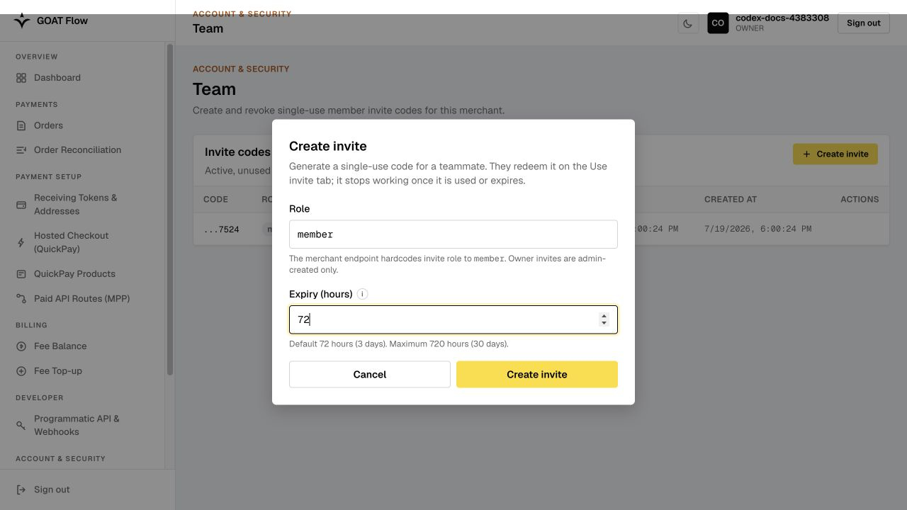

- Owner-created invite codes create `member` users.
- Expiration defaults to 72 hours.
- Expiration may be set up to 720 hours.
- Each invite code is single-use.

The full invite code is shown once. Do not publish it while it is active.

### 10.3 Invitee Registration

The invitee opens the Merchant Portal and uses the **Use invite** tab (Join workspace).

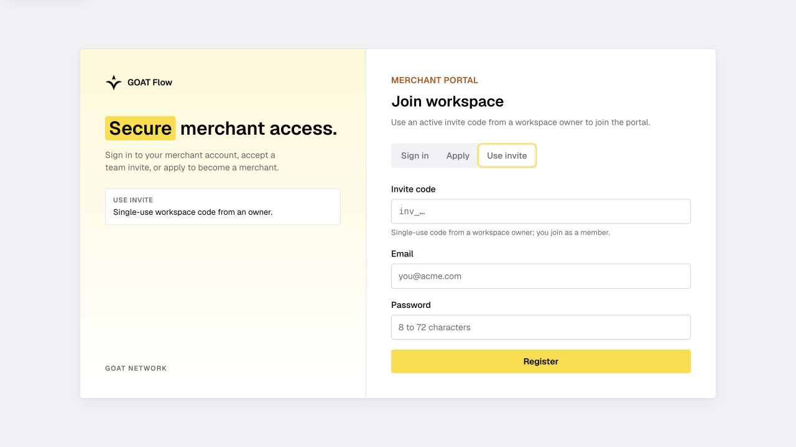

Fill in:

- **Invite code** - The single-use code provided by the workspace owner (starts with `inv_`)
- **Email** - The invitee's email
- **Password** - A password following the 8 to 72 character rule

The invitee joins as a member. Invite-code registration does not require new merchant approval because the merchant is already approved.

After registration, the member is signed in to the same merchant workspace.
Direct navigation to an owner-only page redirects the member back to
**Security**.

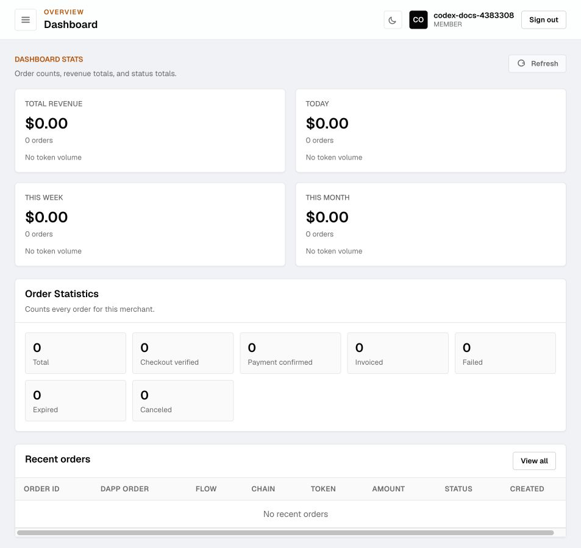

The Team table marks a redeemed code as **Used** and records the member email.

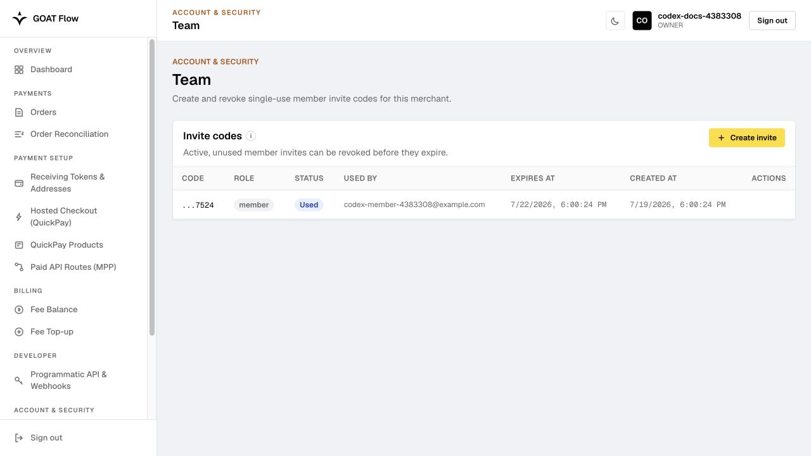

---

## 11. Order Management

Open **Orders** to view all orders.

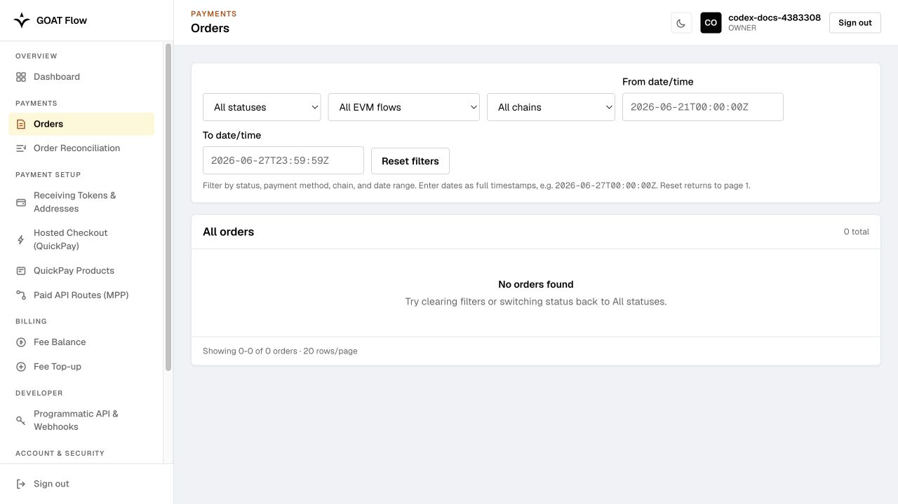

### Filters

| Filter | Options |
| --- | --- |
| **Status** | All / order statuses |
| **Payment method** | All EVM flows / Direct transfer / EIP-3009 / Permit2 |
| **Chain** | All chains / configured deployment chains |
| **From / To** | Full timestamp range |

### Order List Fields

| Column | Description |
| --- | --- |
| Order ID | System order ID |
| Dapp Order | DApp-side order number |
| Payment method | Direct transfer, EIP-3009, or Permit2 |
| Type | Order type, such as x402 payment |
| Token | Payment token, such as USDC |
| Amount | Payment amount |
| User | Payer address |
| Status | Order status |
| Created | Creation time |
| View | Opens the order detail dialog |

Click **View** to see order and transfer data. The dialog includes
chains, token contract and decimals, receiving address, payer, transaction hash,
expiry, memo, timestamps, confirmation details, and compatibility fields related
to the selected method. A `Payout Tx` field in the portal does not mean GOAT Flow
pays out, releases, or settles customer funds to a DIRECT merchant; the buyer's
tokens move directly to the merchant receiving address.

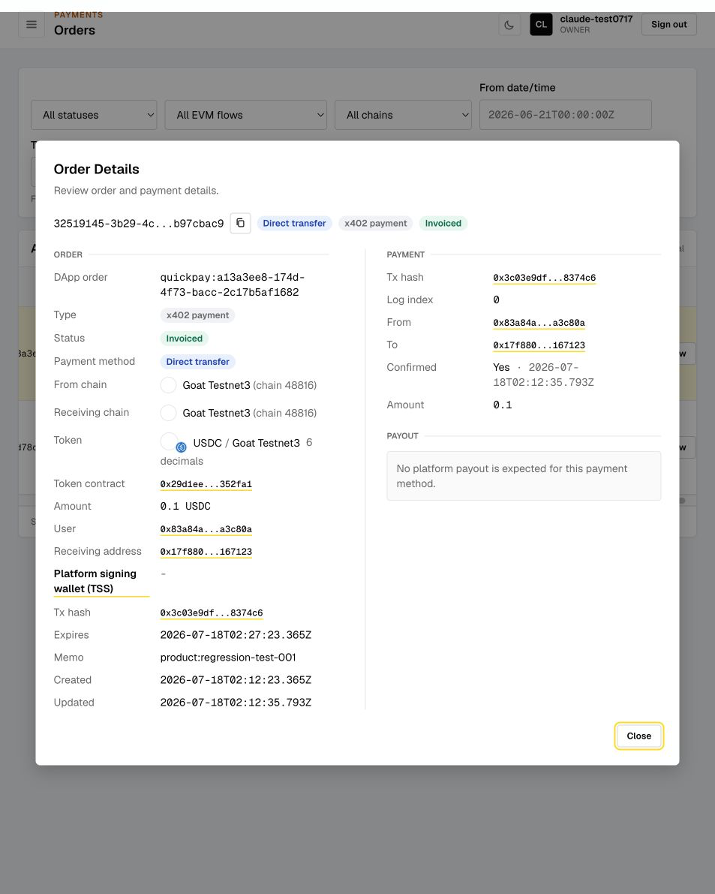

The example shows a Testnet3 DIRECT transfer displayed as `INVOICED`, the
successful terminal state commonly visible after Core records the direct
transfer and invoice.

### 11.1 Order status and fulfillment

Current SDK order status values include:

- `CHECKOUT_VERIFIED`
- `PAYMENT_CONFIRMED`
- `INVOICED`
- `FAILED`
- `EXPIRED`
- `CANCELLED`

The TypeScript `waitForConfirmation()` and Go `WaitForConfirmation` helpers
return on successful `PAYMENT_CONFIRMED` or `INVOICED`, and on `FAILED`,
`EXPIRED`, or `CANCELLED`. Core can advance a DIRECT order from
`PAYMENT_CONFIRMED` to `INVOICED` in one watcher transaction, so a poller may
observe only `INVOICED`.

A terminal status is only one fulfillment input. Read it through an
authenticated backend call or verified webhook, then verify the merchant and
order identifiers, expected chain, token, amount, receiving address, and
transaction identity. Make fulfillment idempotent so a webhook retry or
repeated status poll cannot ship twice.

`getOrderProof()` / `GetOrderProof()` returns a server-issued payment record.
Its historical `signature` field is an unsigned Keccak256 digest of
`order_id`, `tx_hash`, `log_index`, `from_addr`, `to_addr`, `amount_wei`, and
`from_chain_id`, concatenated without separators in that order. It does not
cover `status`; verify the transaction hash on-chain when independent proof is
required.

### 11.2 Order Reconciliation

**Payments → Order Reconciliation** provides
accounting-oriented reports. Filter by
**Chain** and a **From/To** date range, then **Apply**. Summary cards show Total
Orders, Matched Payments (confirmed), Unpaid Orders (waiting or expired before
payment), and Late Payments (received after expiry).

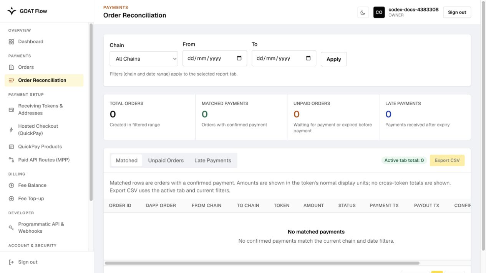

Three report tabs — **Matched**, **Unpaid Orders**, and **Late Payments** — each list
rows with Order ID, Dapp Order, From/To Chain, Token, Amount, Status, Payment Tx,
Payout Tx, and Confirmed At. **Export CSV** exports the active tab under the current
filters. Amounts use the token's normal display units; no cross-token totals are shown.

`Payment Tx` and `Payout Tx` are portal column labels. For DIRECT transfers,
their presence does not imply that GOAT Flow holds or later disburses buyer funds.

---

## 12. QuickPay and Products

QuickPay is the public hosted checkout and agent-commerce surface for human
buyers and AI agents.

The portal requires:

- Merchant is enabled
- QuickPay is enabled
- At least one eligible receiving token is configured
- The active deployment exposes the required fee and limit configuration

### 12.1 Configure QuickPay

QuickPay must be enabled for the merchant. After approval, inspect **Profile**
or **Hosted Checkout (QuickPay)**:

- If the account state is **Live**, configure it directly.
- If it is unavailable, contact
  [Support@goat.network](mailto:Support@goat.network).

Manage the live configuration under **Payment Setup → Hosted Checkout
(QuickPay)**:

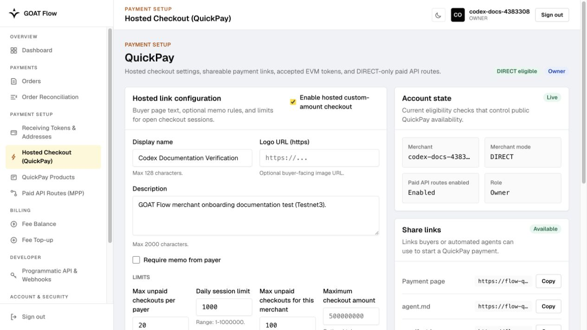

Configure and verify QuickPay in this order:

1. Confirm **Account state** is live, the merchant is enabled and in `DIRECT`
   mode, and the current user is the owner.
2. Confirm every token you intend to expose has a receiving-address row. Compare
   the displayed chain ID, token contract, decimals, and min/max amount with the
   active environment record.
3. In **Hosted link configuration**, set the buyer-facing Display name,
   Description, and optional HTTPS Logo URL.
4. Decide whether to enable hosted custom-amount checkout. If it is enabled,
   decide whether a payer memo is required.
5. Set limits for unpaid checkouts per payer, daily sessions, merchant-wide open
   sessions, and maximum checkout amount. Start conservatively on Mainnet.
6. Save the configuration and reload the page. Confirm the values persisted and
   **Account state** remains live.
7. Copy and open the **Payment page**, **`agent.md`**, and **`manifest.json`**
   links in a signed-out browser. They must resolve on the expected environment
   origin and must not expose merchant API credentials.
8. Check **Accepted EVM tokens for QuickPay**. Do not launch if a contract,
   decimals value, receiving address, or limit differs from the approved
   Mainnet configuration.

QuickPay links are served from a dedicated origin (for example,
`flow-quickpay.goat.network`; Testnet3:
`flow-quickpay.testnet3.goat.network`). Copy the links from the portal instead of
constructing them by hostname substitution.

The merchant API also exposes these owner-only configuration operations. They
are service endpoints rather than SDK convenience methods:

| Action | API path | Notes |
| --- | --- | --- |
| Read config | `GET /merchant/v1/quickpay` | Shows eligibility, display config, caps, token list, and public links |
| Update config | `PUT /merchant/v1/quickpay` | Owner-only |

Config fields include `quickpay_enabled`, `display_name`, `description`, `logo_url`, `memo_required`, `max_amount_wei`, `max_open_sessions`, `daily_session_limit`, and `max_open_sessions_merchant_wide`.

### 12.2 QuickPay Products

QuickPay Products are predefined fixed-price items. A product carries a
token-agnostic decimal `price`; the buyer or agent chooses an
eligible chain and token, and the QuickPay client independently converts the
price using the selected token decimals and refuses to broadcast if the session
amount does not match.

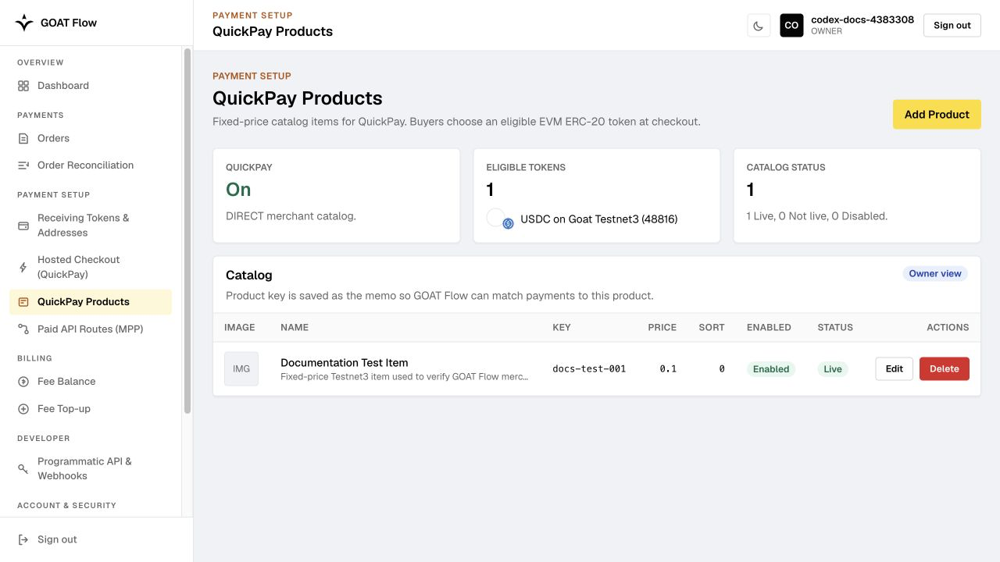

The merchant API exposes these product operations:

| Action | Merchant API path |
| --- | --- |
| List products | `GET /merchant/v1/quickpay/products` |
| Create product | `POST /merchant/v1/quickpay/products` |
| Update product | `PUT /merchant/v1/quickpay/products/:product_key` |
| Delete product | `DELETE /merchant/v1/quickpay/products/:product_key` |

The QuickPay public type and manifest validator cover these published product
fields:

| Field | Notes |
| --- | --- |
| `product_key` | Identifier; must match `^[A-Za-z0-9._:~-]{1,64}$` |
| `name` | Required display name |
| `description` | Optional |
| `image_url` | Optional HTTPS URL |
| `price` | Required positive decimal, token-agnostic |

The portal also exposes `enabled` and `sort_order`,
and treats the product key as the update/delete path identifier. Those fields,
defaults, and immutability rules are not exported or validated by the current
QuickPay client, and the public manifest does not currently publish them.

Product-bound sessions use `product_key` plus the
buyer-selected `chain_id` and `token_contract`. The server response pins the
authoritative amount and memo (`product:<product_key>`), and the client verifies
the amount before broadcast.

The public payment page presents live products and allows custom amount checkout
when that mode is enabled.

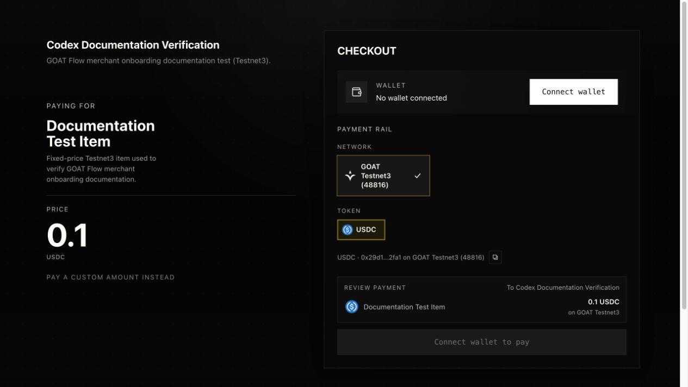

For each product:

1. Choose a stable `product_key`; treat it as an integration identifier, not a
   display label.
2. Enter the buyer-facing name, optional description/image, decimal price,
   enabled state, and sort order.
3. Save it, then confirm the catalog row is **Enabled** and **Live**.
4. Open the public payment page and verify the name, description, price, and
   eligible tokens.
5. Create one small environment-appropriate checkout. Confirm it appears under
   **Orders** and **Order Reconciliation** before connecting fulfillment.

Custom-amount checkout is suitable for donations, tips, and other
buyer-controlled amounts. Use a Product or an authenticated Checkout Session
when the merchant must control the price. Never fulfill solely from a browser
success callback; use a trusted webhook or backend order/session status.

### 12.3 Public agent and CLI access

The QuickPay library uses the shared QuickPay
link origin as its trust anchor, derives every endpoint from that origin, requires
HTTPS except for loopback development, validates the manifest, and does not use
merchant API credentials on the buyer side.

| Surface | API path |
| --- | --- |
| Public discovery | `GET /quickpay/v1/merchants/:merchant_id` |
| Agent guide | `GET /quickpay/:merchant_id/agent.md` |
| Manifest | `GET /quickpay/:merchant_id/manifest.json` |
| Create x402 session | `POST /quickpay/v1/x402/sessions` |
| Get session status | `GET /quickpay/v1/x402/sessions/:session_id` |

For custom amounts, `POST /quickpay/v1/x402/sessions` accepts `merchant_id`, `payer_addr`, `chain_id`, `token_contract`, `amount_wei`, optional `memo`, and optional `idempotency_key`.

For product sessions, send `product_key` with `merchant_id`, `payer_addr`, `chain_id`, `token_contract`, and optional `idempotency_key`.

Browser merchants can open these fixed-price products with
`goatflow-checkout` and no merchant secret in the page. Dynamic DIRECT carts use
an HMAC-created Checkout Session instead; see
[Hosted Checkout](goat-flow-checkout.md).

Agent/CLI entry points:

```bash
npx goatflow-quickpay inspect \
  https://flow-quickpay.goat.network/quickpay/<merchant_id>/agent.md --json

npx goatflow-quickpay pay-x402 https://flow-quickpay.goat.network/quickpay/<merchant_id>/agent.md \
  --amount <amount> --token-contract <token_contract> --chain <chain_id> \
  --idempotency-key <payment_intent_id>

npx goatflow-quickpay pay-product https://flow-quickpay.goat.network/quickpay/<merchant_id>/agent.md \
  --product <product_key> --token-contract <token_contract> --chain <chain_id> \
  --idempotency-key <payment_intent_id>

npx goatflow-quickpay pay-mpp https://flow-quickpay.goat.network/quickpay/<merchant_id>/agent.md \
  --route GET:api:data
```

Operational rules:

- Read the chain, token contract, decimals, limits, products, and MPP routes from
  `manifest.json`; do not substitute values from a screenshot.
- Supply the payer key through `QUICKPAY_PRIVATE_KEY` or a permission-restricted
  `--wallet-file`. Passing it with `--wallet` can leak through process listings,
  shell history, logs, and agent transcripts.
- Reuse one idempotency key for retries of the same QuickPay intent. A reused
  session is resumed rather than automatically paid again.
- Do not use `--force` unless you have independently established that no transfer
  was broadcast for the reused session.
- Retain the returned session/order ID and transaction hash, then reconcile the
  trusted backend status before fulfillment.
- QuickPay session terminal states are `PAYMENT_CONFIRMED`, `EXPIRED`, `FAILED`,
  and `CANCELLED`; this is separate from the Server SDK order model, which also
  treats `INVOICED` as a successful terminal state.
- Polling is bounded by a hard overall timeout. A known transaction hash is
  retained across poll failures, and `EXPIRED` with a known hash receives five
  bounded grace polls for a possible late confirmation. Never rebroadcast solely
  because status polling or receipt verification failed.

Agents should use `manifest.json` as the machine-readable capability and pricing
surface and validate every command shown by `agent.md` against the installed
`goatflow-quickpay` package.

### 12.4 Paid API Routes (MPP)

**Payment Setup → Paid API Routes (MPP)**
configures **fixed-price protected API endpoints** that agents pay for through
the Machine Payments Protocol (MPP).

**About MPP.** [MPP](https://mpp.dev/overview) is an independent open
protocol, not a GOAT Flow protocol. This portal configures GOAT Flow's current
MPP integration profile. Its JSON endpoints, direct ERC-20 transfer, and signed
three-segment receipt are GOAT-specific implementation contracts, not the
generic MPP wire format.

MPP availability and supported chains are runtime configuration. Do not
hardcode the page's descriptive copy or a single chain ID.
Read the active chain selector, supported tokens, receiving rows, and public
manifest.

Route management requires:

- the **Owner** role
- an enabled merchant in **DIRECT** mode
- Paid API Routes enabled for the merchant
- a supported chain/token pair
- a matching receiving address

Configure and operate an MPP route in this order:

1. Define the protected HTTP method and path in application code first.
2. Convert it to the portal's canonical colon-delimited identifier, for example
   `GET /api/docs/protected` → `GET:api:docs:protected`.
3. Add and verify the route's intended receiving chain/token under **Receiving
   Tokens & Addresses**.
4. Open **Paid API Routes (MPP)** and confirm the status card says routes are
   manageable.
5. Select **Add Route**, enter the canonical route, version, active
   network/token, and fixed decimal amount, then save.
6. Confirm the new row is active and shows the expected token contract,
   receiving address, and amount.
7. Open the public QuickPay `manifest.json` and confirm the MPP rail contains the
   exact route and current pricing version.
8. Run a Testnet3 buyer flow: request the challenge, broadcast exactly the
   instructed ERC-20 amount, verify the transaction, and call the protected
   endpoint with the returned `Payment-Receipt`.
9. Verify the resource server rejects missing, malformed, expired,
   cross-merchant, wrong-route, and replayed receipts according to the intended
   receipt policy.

Each route row carries a paid resource path, version, network/token, payment
token contract address, the receiving address for that token, amount, and status.
A matching receiving address must already exist for the token before a route can
be added.

Route identifiers are colon-delimited, for example
`GET:api:docs:protected`; slashes and spaces are not accepted by the current
portal form.

> Testnet3 may show stale helper text that mentions "Tempo only". Use the active
> chain selector and API response to determine available routes.

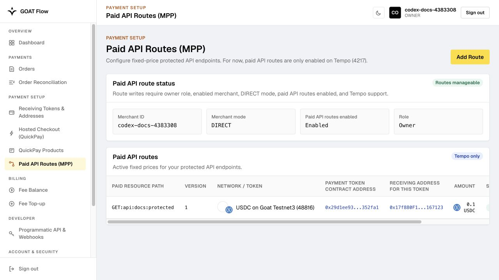

The current GOAT Flow MPP adapter:

1. Treats `POST /mpp/v1/challenge` returning HTTP `402` as a successful payment
   instruction.
2. Transfers exactly the challenged token amount to the challenged recipient.
3. Calls `POST /mpp/v1/verify`; HTTP `200` must include a valid
   `Payment-Receipt` response header, while `202` and `429` are retried according
   to `Retry-After`.
4. Preserves the challenge and transaction hash in recoverable post-broadcast
   errors so verification can resume without paying again.

The merchant resource server must verify the signed receipt against the exact
merchant, route/request canonicalization, expiry, signature, and replay policy.
The current receipt does not carry `route_pricing_version`; Core binds pricing
to the challenge/order, so middleware cannot independently compare that version
without a future receipt extension. For browser use, Core must allow the DApp
origin and expose `Payment-Receipt`, while the protected resource must allow the
same origin and the `Payment-Receipt` request header. Multi-replica deployments
need a shared atomic consumption store when receipts are single-use.

For the protocol boundary and this profile's buyer/agent flow, see
[GOAT Flow MPP Integration](./mpp.md).

---

<a id="13-balance-fees-and-topup"></a>

## 13. Balance, Fees, and Top-up

> **Environment note:** screenshots in this section show Testnet3. Mainnet fee
> amounts, supported chains and assets, limits, and top-up behavior may differ.
> Confirm the live Mainnet **Billing** pages before launch, and do not perform a
> Mainnet top-up without authorization.

Open **Billing → Fee Balance** to view service-fee credits; use **Billing → Fee
Top-up** to add service-fee credits.

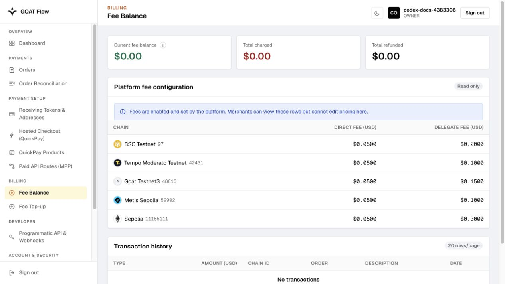

### 13.1 Fee Balance

**Fee Balance** is a prepaid service-fee credit ledger, separate from
buyer-to-merchant transfers. It is not a balance of customer funds.
The Testnet3 UI states that new order or session services can stop when the
credit balance is depleted. The active per-chain fee is displayed in **Platform
fee configuration**; do not assume one global price or reuse Testnet3 fees on
Mainnet.

### 13.2 Self-Service Top-up

The Testnet3 **Fee Top-up** page requires:

- a supported top-up destination chain
- an amount in USD
- a connected EVM wallet
- a supported USDT or USDC top-up asset

The page displays USDT and USDC as 1:1 USD for this Testnet3 top-up flow.
Supported chains, top-up assets, receiving wallets, limits, confirmation policy,
and crediting behavior can differ by environment.

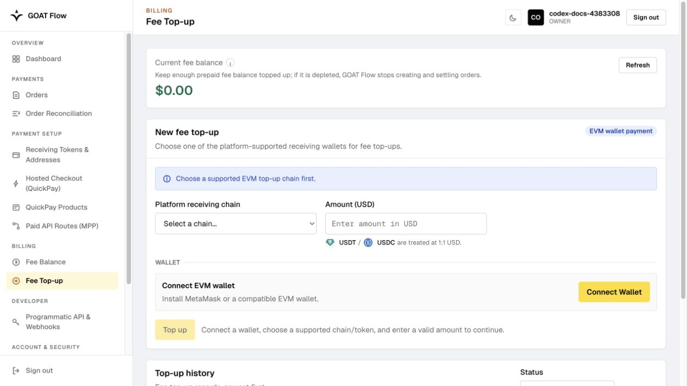

Top-up history can be filtered by `PENDING`, `COMPLETED`, `EXPIRED`, or `FAILED`.
Confirm the final status and corresponding Fee Balance credit before relying on
a top-up. Do not infer refund or retry behavior from an empty form.

### 13.3 Balance Cards

| Card | Description |
| --- | --- |
| **Current fee balance** | Current prepaid service-fee credit balance |
| **Total charged** | Cumulative fees charged |
| **Total refunded** | Cumulative refunded fees |

### 13.4 Fee Configuration

The **Platform fee configuration** table is read-only: merchants can view
configured fee rows but cannot edit pricing.

Check the Mainnet table or API for active fees before launch. Testnet3 values are
examples only and must not be quoted as Mainnet pricing.

### 13.5 Transaction History

The transaction history table exposes amount, chain ID, order, description, and
date columns:

| Type | Description |
| --- | --- |
| **Fee charged** | Order or session fee deduction (e.g. order creation fee) |
| **Fee refunded** | A returned fee recorded by the active deployment |
| **Fee funds added** | Service-fee credit added to Fee Balance (e.g. a top-up) |

Do not assume that every cancellation or expiry refunds a fee, that every top-up
is reversible, or that fee events are posted at
a particular lifecycle state unless the active Mainnet policy documents that
behavior.

---

## 14. Audit Logs

Open **Audit Logs** to view operation records.

The page is read-only and shows events newest first. The current portal shows 30
rows per page; filter and export availability may vary.

Typical audit events include:

- Profile changes
- Receiving address additions and removals
- Merchant approval and operator capability changes
- API key rotation
- Webhook configuration changes
- QuickPay configuration and product changes
- MPP route changes
- Invite code creation and revocation
- Other deployment-defined account actions

Each record contains:

| Field | Description |
| --- | --- |
| Time | When the action occurred |
| Action | Operation type |
| Description | Human-readable summary |
| Details | Structured action details and changed values |
| IP | Source IP address |

Audit rows may contain addresses, account identifiers, and source IPs. Do not
share or publish unredacted audit data.

---

## Appendix: Quick Start Checklist

Complete the following steps to start receiving direct buyer-to-merchant
transfers:

- [ ] 1. Register a merchant account
- [ ] 2. Wait for admin approval
- [ ] 3. Log in and optionally enable 2FA
- [ ] 4. Add receiving addresses for each accepted Chain + Token
- [ ] 5. Choose the integration path: QuickPay/Products or authenticated programmatic APIs
- [ ] 6. If using programmatic APIs, generate API keys and save the API Secret server-side
- [ ] 7. If using webhooks, configure the callback and save its one-time secret
- [ ] 8. Verify Mainnet fees independently; use Testnet3 top-up only with Testnet3 assets and wallets
- [ ] 9. If using QuickPay, publish the hosted link and optionally create Products or MPP routes
- [ ] 10. Complete a test buyer transfer, confirm it in Orders and Order Reconciliation, and exercise the deployment's fulfillment-state contract

```bash
# Install SDKs
npm install goatflow-sdk goatflow-sdk-server

# Backend configuration
GOATX402_API_URL=https://flow-api.goat.network
GOATX402_API_KEY=your_API_Key
GOATX402_API_SECRET=your_API_Secret
```

---

Support: [Support@goat.network](mailto:Support@goat.network)
