# GOAT x402 Merchant Onboarding Guide

> This guide walks merchants through registering, configuring, and operating a GOAT x402 payment integration.

---

## Table of Contents

1. [Overview](#1-overview)
2. [Payment Modes and Supported Chains](#2-payment-modes-and-supported-chains)
3. [Register a Merchant Account](#3-register-a-merchant-account)
4. [Approval, Login, and Account Security](#4-approval-login-and-account-security)
5. [Dashboard Overview](#5-dashboard-overview)
6. [Configure Receiving Addresses and Callback Contracts](#6-configure-receiving-addresses-and-callback-contracts)
7. [Merchant Settings](#7-merchant-settings)
8. [API Keys Management](#8-api-keys-management)
9. [Webhook Configuration](#9-webhook-configuration)
10. [Team Management and Invite Codes](#10-team-management-and-invite-codes)
11. [Order Management](#11-order-management)
12. [QuickPay and Products](#12-quickpay-and-products)
13. [Balance, Fees, and Topup](#13-balance-fees-and-topup)
14. [Audit Logs](#14-audit-logs)

---

## 1. Overview

The GOAT x402 Merchant Portal is your management dashboard for:

- Registering and managing your merchant identity
- Configuring receiving addresses, callback contracts, and supported chains/tokens
- Managing team members, account security, API keys, and webhook callbacks
- Viewing orders, balances, reconciliation, and audit history
- Publishing QuickPay links, products, and agent-native payment surfaces

**Access URLs:**

- Merchant Portal: `https://x402-merchant.goat.network`
- Production API: `https://x402-api.goat.network`

---

## 2. Payment Modes and Supported Chains

You choose a receive mode during registration. The receive mode is not a routine merchant self-service setting: changing it later requires admin action and is blocked while receiving addresses or callback contracts are configured.

### DIRECT Mode

User or agent payments go directly to your receiving wallet on the same chain as the order.

- Fund flow: User wallet -> Merchant wallet
- Mechanism: ERC-20 `transfer`
- Best for: Tips, donations, simple checkout, QuickPay links, agent payments
- Requirements: A receiving address for each chain/token you accept
- Contract callback: Not used
- Proof: Confirmed orders can expose payment proof for audit and reconciliation

**Example:** A content platform has a GOAT mainnet USDC receiving address. A buyer pays USDC on GOAT mainnet to that same-chain merchant address. The watcher matches the transfer to the order; no TSS settlement or callback contract is involved.

### DELEGATE Mode

DELEGATE is a TSS-assisted EVM settlement path for flows that need
payment-triggered contract execution. The merchant configures one callback/
settlement chain; an eligible buyer source chain may differ.

- Fund flow: User payment on an eligible source chain -> TSS-controlled settlement path -> Merchant callback contract / settlement chain
- Mechanism: EIP-3009 or Permit2 `SignatureTransfer`, TSS co-signing, SubmitMonitor submission, and merchant callback
- Best for: In-game purchases, per-call API billing, NFT minting, and other post-payment execution
- Requirements: One EVM callback chain per merchant, receiving token configuration on that chain, and an admin-approved callback contract on the same chain
- Cross-chain checkout: decimal-price Hosted Checkout may offer source-chain/token candidates derived from live TSS and token configuration
- Proof: Confirmed orders can expose verifiable proof

**Example:** A game operates on GOAT mainnet. The player authorizes a USDC payment on GOAT mainnet; Core verifies the order and the TSS-backed settlement path calls the game's approved GOAT callback contract. The player receives the item without any bridge or chain switch.

### Mode Comparison

| Feature | DIRECT | DELEGATE |
| --- | --- | --- |
| Fund flow | User -> Merchant | Eligible source-chain payment -> TSS settlement -> callback/merchant chain |
| Chain scope | Selected payment/receiving chain | One merchant callback chain; eligible source chain may differ |
| Contract callback | No | Yes, via admin-approved callback contract |
| Gas sponsorship for callback/settlement | No callback path | TSS-submitted settlement/callback path |
| Settlement proof | Yes, after confirmation | Yes, after confirmation |
| Public QuickPay product/link | Yes | No |
| Server-created Hosted Checkout | Yes | Yes |
| Integration difficulty | Simplest | Requires callback contract review |
| Best for | Simple payments and public payment links | Contract execution after payment |

### Supported Mainnet Matrix

| Chain | Chain ID | DIRECT | DELEGATE | Explorer |
| --- | ---: | --- | --- | --- |
| Ethereum | `1` | Yes | Yes | `etherscan.io` |
| Polygon | `137` | Yes | Yes | `polygonscan.com` |
| BSC | `56` | Yes | Yes | `bscscan.com` |
| Arbitrum | `42161` | Yes | Yes | `arbiscan.io` |
| Optimism | `10` | Yes | Yes | `optimistic.etherscan.io` |
| Avalanche | `43114` | Yes | Yes | `snowtrace.io` |
| Base | `8453` | Yes | Yes | `basescan.org` |
| Berachain | `80094` | Yes | Yes | `berascan.com` |
| X Layer | `196` | Yes | Yes | `web3.okx.com/explorer/x-layer/evm` |
| GOAT | `2345` | Yes | Yes | `explorer.goat.network` |
| Metis | `1088` | Yes | No | `andromeda-explorer.metis.io` |
| Tempo | `4217` | Yes | No | `explore.tempo.xyz` |

> This matrix reflects the current checked-in platform configuration. Actual chain, token, and
> contract support is config-driven and can vary by merchant — read supported chains and
> parameters from the merchant/Core configuration or the API at runtime instead of hardcoding
> this table.

---

## 3. Register a Merchant Account

### 3.1 Open the Registration Page

Visit the Merchant Portal and click the **Apply** tab to access the registration form.

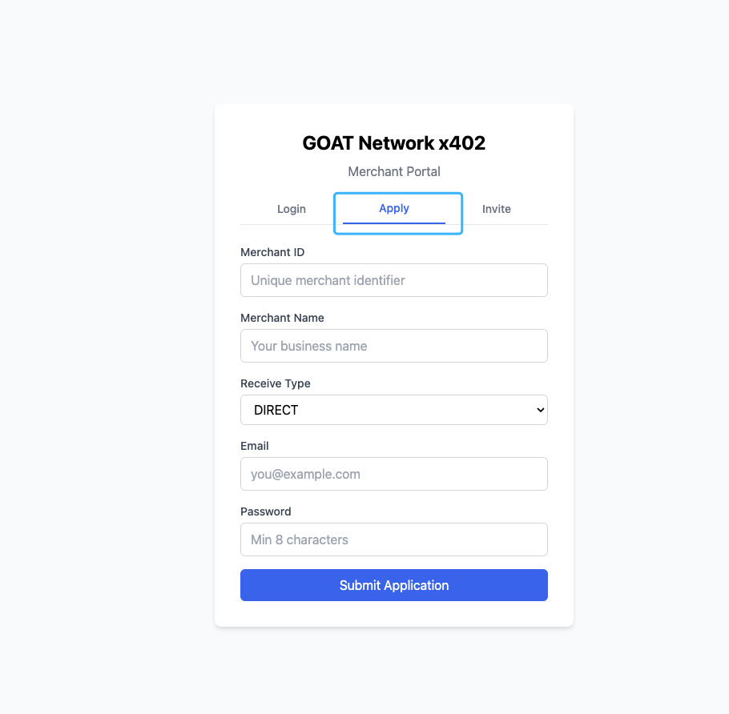

### 3.2 Fill in Registration Details

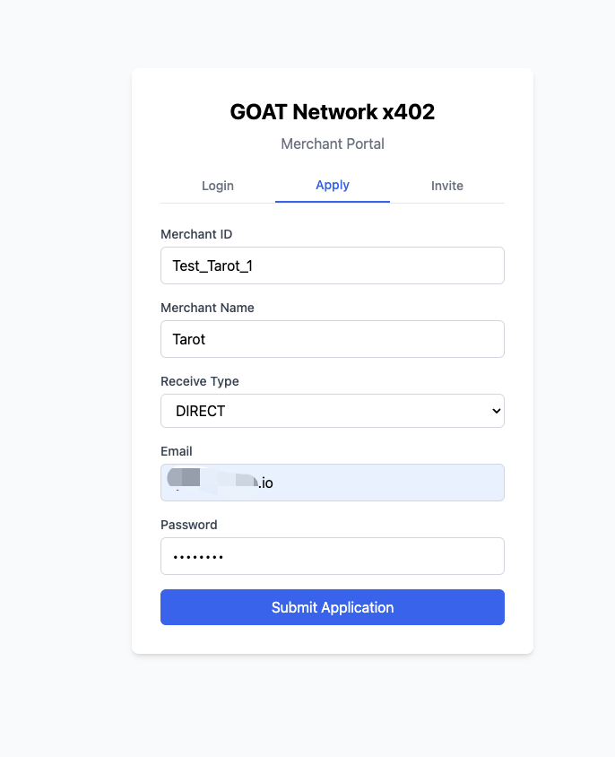

| Field | Description | Format Requirements |
| --- | --- | --- |
| **Merchant ID** | Unique merchant identifier; cannot be changed after registration | Letters, numbers, hyphens, and underscores only. Reserved IDs and `topup-` / `topup_` prefixes are not available. |
| **Merchant Name** | Display name; can be changed later | Any merchant display text |
| **Receive Type** | Payment mode. `DIRECT` and `DELEGATE` are mutually exclusive; the choice is fixed at registration (a later change is admin-only and blocked while addresses/contracts exist) | Select `DIRECT` or `DELEGATE` after confirming the chain/mode matrix above |
| **Email** | Owner login email | Valid email address |
| **Password** | Owner login password | 8 to 72 characters |

### 3.3 Submit Application

Click **Submit Application** when done.

After submission, the system displays a pending-approval state. Self-registration creates the merchant and owner user, but does not issue access tokens until an admin approves the merchant.

---

## 4. Approval, Login, and Account Security

### 4.1 Admin Approval

After registration, a GOAT x402 administrator reviews the application. Approval enables the merchant; rejection records a reason for the applicant.

### 4.2 Login

Once approved, open the Merchant Portal and switch to the **Login** tab.

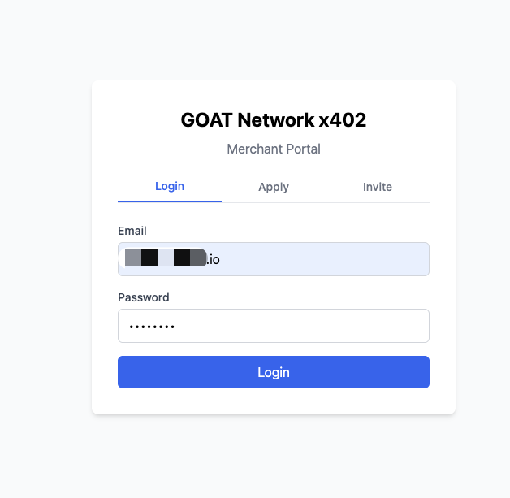

Enter the email and password used during registration. If 2FA is enabled for the user, complete the TOTP or recovery-code challenge before entering the dashboard.

Login intentionally uses generic failures for pending, disabled, locked, or invalid accounts so that attackers cannot infer account state.

### 4.3 Password Change and Forced Reset

Every authenticated merchant user can change their own password:

```text
POST /merchant/v1/account/change-password
```

Request fields:

| Field | Description |
| --- | --- |
| `current_password` | Current password, or the one-time temporary password from an admin reset |
| `new_password` | New password; 8 to 72 characters, different from the current password, and not equal to the user email |

When an admin resets a merchant user's password, the account is marked `must_change_password=true`. The user can log in with the temporary password, but the session is confined to `POST /merchant/v1/account/change-password` until a new password is set. Changing the password clears the forced-change flag and bumps `mfa_epoch`, evicting other refresh tokens.

### 4.4 Lockout Rules

| Surface | Failed attempts | Lock duration | Response behavior |
| --- | ---: | --- | --- |
| Login password | 5 | 15 minutes | Generic `401` |
| Current password check on change-password | 5 | 15 minutes | `400` until locked, then `429` |
| TOTP or recovery-code verification | 5 | 15 minutes | `403` until locked, then `429` |

### 4.5 Self-Service 2FA

2FA is per user. Use the Settings page to enroll, confirm, or disable TOTP.

| Operation | API path | Notes |
| --- | --- | --- |
| Start enrollment | `POST /merchant/v1/totp/enroll` | Returns the TOTP setup data and QR payload |
| Confirm enrollment | `POST /merchant/v1/totp/confirm` | Enables TOTP and returns one-time recovery codes |
| Disable 2FA | `POST /merchant/v1/totp/disable` | Requires a valid TOTP code or unused recovery code |

Store recovery codes securely. They are meant for account recovery if the authenticator is unavailable.

### 4.6 Lost Password or Authenticator

If you lose your password or 2FA authenticator and cannot recover with a one-time recovery code, contact the GoatX402 platform team to request a reset. A platform administrator can issue a one-time temporary password (which forces a password change on your next login) or reset your 2FA. This is an admin-assisted operation; the administrator procedure lives in the operator runbook (`ONBOARDING.md`).

---

## 5. Dashboard Overview

After login, you'll land on the Dashboard page.

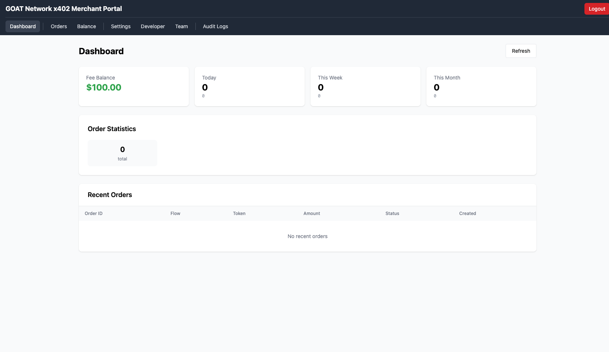

The Dashboard displays:

| Card | Description |
| --- | --- |
| **Fee Balance** | Current prepaid fee balance |
| **Today** | Today's order count and volume |
| **This Week** | This week's order count and volume |
| **This Month** | This month's order count and volume |

Below the cards:

- **Order Statistics** - Total order count
- **Recent Orders** - Latest orders list

New merchants show zero counts until orders are created and paid.

---

## 6. Configure Receiving Addresses and Callback Contracts

Go to the **Settings** page and find the **Receiving Addresses** section.

### 6.1 Add a Receiving Address

Click **Add Address** in the top right to open the form.

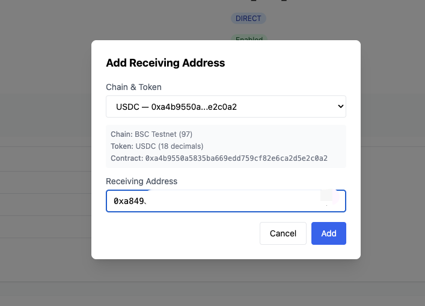

| Field | Description |
| --- | --- |
| **Chain** | Select a supported mainnet chain, such as GOAT (`2345`), Base (`8453`), X Layer (`196`), or Metis (`1088`) |
| **Token** | Select a configured token, such as USDC or USDT |
| **Address** | Your EVM receiving address (`0x` + 40 hex characters) |

Important rules:

- Each Chain + Token combination can only have one address.
- Address and token contract must be valid EVM addresses.
- Available chains/tokens come from platform configuration.
- For `DELEGATE`, all receiving addresses must be on a single EVM chain.
- For `DELEGATE`, the receiving-address chain must match the callback-contract chain.

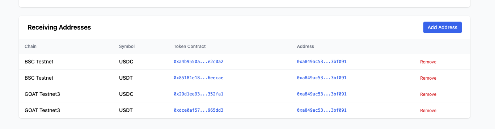

### 6.2 Callback Contracts for DELEGATE

DELEGATE merchants must submit a callback contract for admin review before
callback execution can be used. The contract and merchant receiving-token
configuration remain locked to the same settlement chain.

Merchant self-service endpoints:

| Action | API path | Fields |
| --- | --- | --- |
| List active and pending/rejected submissions | `GET /merchant/v1/callback-contracts` | None |
| Submit for review | `POST /merchant/v1/callback-contracts` | `chain_id`, `spent_address`, optional `spent_permit2_func_abi`, optional `spent_erc3009_func_abi`, optional `eip712_name`, optional `eip712_version` |
| Cancel pending submission | `DELETE /merchant/v1/callback-contracts/submissions/:submission_id` | Path parameter |
| Remove active contract | `DELETE /merchant/v1/callback-contracts/:chain_id` | Path parameter; blocked while in-flight orders exist on that chain |

After you submit a callback contract it enters review and becomes active only after a platform administrator approves it. Contact the GoatX402 team to request review. (The administrator review procedure lives in the operator runbook, `ONBOARDING.md`.)

The callback contract must be on the same chain as the DELEGATE merchant's receiving addresses. Metis and Tempo are DIRECT-only in the matrix above.

---

## 7. Merchant Settings

Go to the **Settings** page to view and edit merchant information.

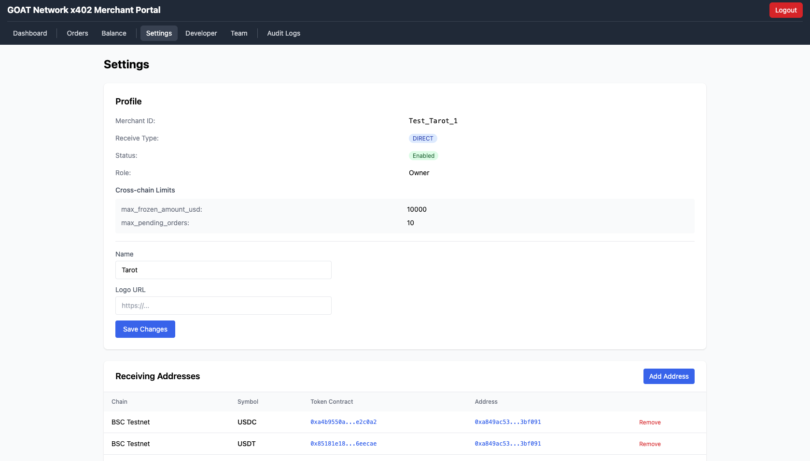

### Profile Information

| Field | Editable | Description |
| --- | --- | --- |
| Merchant ID | No | Set during registration |
| Receive Type | No | `DIRECT` or `DELEGATE`; admin-only change, blocked while addresses/contracts exist |
| Status | No | Enabled / Disabled |
| Role | No | Owner or Member |
| Name | Yes | Merchant display name |
| Logo URL | Yes | Merchant logo image URL |

Click **Save Changes** after modifications.

### Limits

The Settings and QuickPay pages may display limits configured by the platform, such as maximum frozen amount, pending orders, maximum open QuickPay sessions, or per-merchant daily session caps. These are operational controls and may be admin-configured.

---

## 8. API Keys Management

Go to the **Developer** page to view and manage API keys.

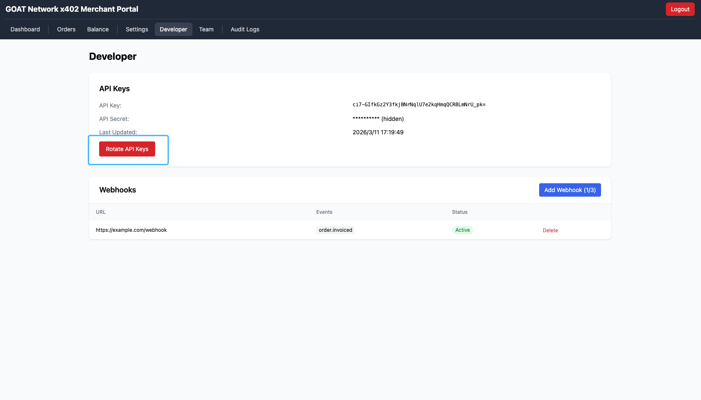

### After Rotation

After clicking **Rotate API Keys**, the system generates a new API Key and API Secret. The secret is shown only once; save it immediately.

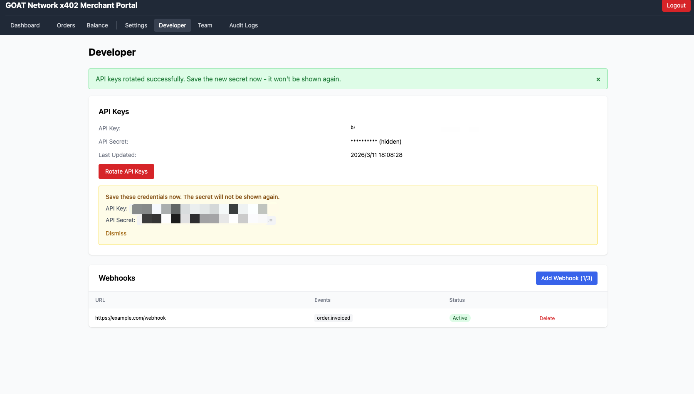

| Field | Description |
| --- | --- |
| **API Key** | Public key for identifying your merchant |
| **API Secret** | Private HMAC key; shown only once when generated |
| **Last Updated** | Last rotation timestamp |

Use API keys only from your backend:

```bash
GOATX402_API_URL=https://x402-api.goat.network
GOATX402_API_KEY=your_API_Key
GOATX402_API_SECRET=your_API_Secret
```

Server-side calls to `/api/v1/*` are HMAC protected and require:

| Header | Required |
| --- | --- |
| `X-API-Key` | Yes |
| `X-Timestamp` | Yes |
| `X-Nonce` | Yes |
| `X-Sign` | Yes |

Do not expose the API Secret in frontend code or public repositories. If you suspect a key leak, rotate immediately; old keys are invalidated.

---

## 9. Webhook Configuration

Webhooks notify you when an order reaches the merchant-facing invoiced state. The current webhook event is `order.invoiced`; use order polling or reconciliation views for other status changes.

### 9.1 Add a Webhook

On the Developer page, click **Add Webhook**.

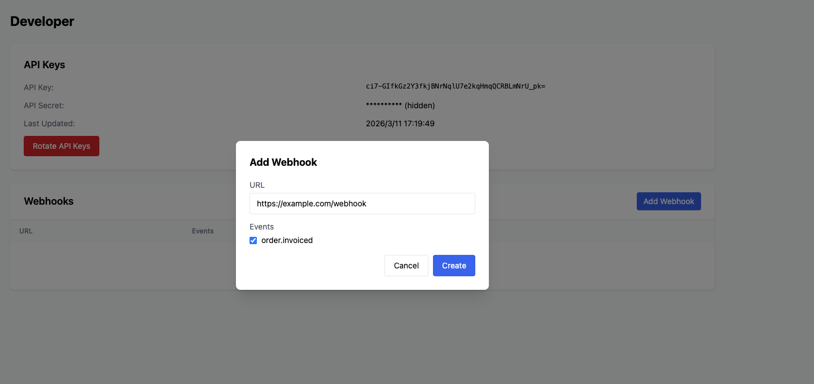

| Field | Description |
| --- | --- |
| **URL** | Your callback URL. Must be HTTPS. Example: `https://your-app.com/api/x402/callback` |
| **Events** | Events to subscribe to. Current merchant-facing event: `order.invoiced` |

Restrictions:

- URL must be HTTPS.
- `localhost` URLs are not allowed.
- Maximum 3 webhooks per merchant.

### 9.2 Save the Webhook Secret

After creation, the system displays the **Webhook Secret**.

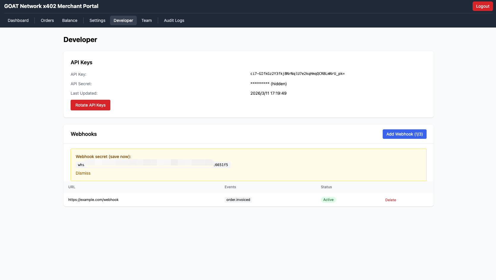

The Webhook Secret is shown only once. Save it immediately and use it to verify incoming webhook requests.

---

## 10. Team Management and Invite Codes

Merchant Owners can invite others to join the team. Invited members have read-only operational access and can manage their own account security.

### 10.1 Role Permission Comparison

| Feature | Owner | Member |
| --- | --- | --- |
| View Dashboard | Yes | Yes |
| View Orders | Yes | Yes |
| View Balance | Yes | Yes |
| Manage own password and 2FA | Yes | Yes |
| Modify profile and receiving settings | Yes | No |
| Manage callback contract submissions | Yes | No |
| Manage API keys | Yes | No |
| Manage webhooks | Yes | No |
| Manage QuickPay and Products | Yes | No |
| Manage Team / Invite Codes | Yes | No |
| View Audit Logs | Yes | Yes |

### 10.2 Create an Invite Code

Go to the **Team** page and click **Create Invite Code**.

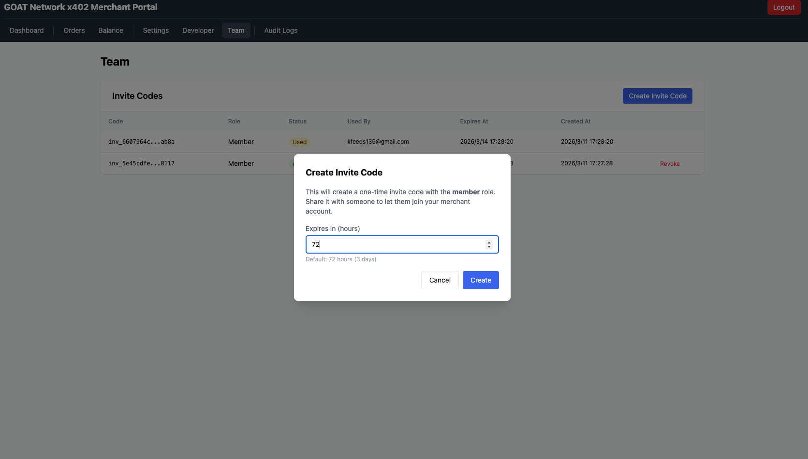

- Owner-created invite codes create `member` users.
- Expiration defaults to 72 hours.
- Each invite code is single-use.

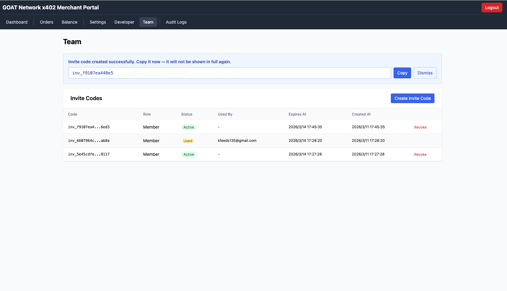

### 10.3 Invitee Registration

The invitee opens the Merchant Portal and switches to the **Invite** tab.

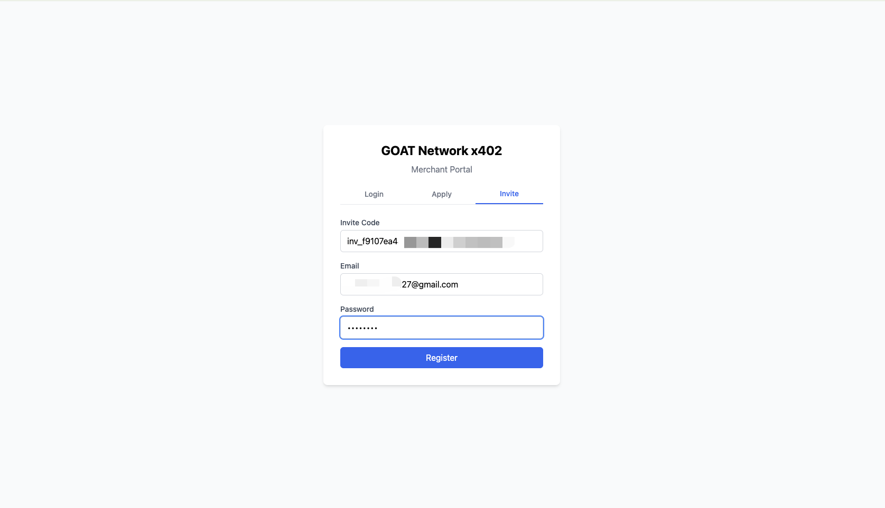

Fill in:

- **Invite Code** - The code provided by the Owner
- **Email** - The invitee's email
- **Password** - A password following the 8 to 72 character rule

Invite-code registration does not require new merchant approval because the merchant is already approved.

---

## 11. Order Management

Go to the **Orders** page to view all orders.

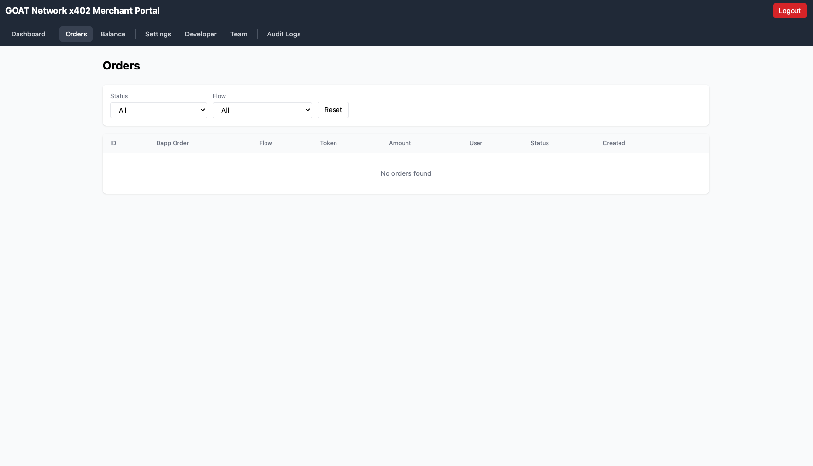

### Filters

| Filter | Options |
| --- | --- |
| **Status** | All / order statuses |
| **Flow** | All / DIRECT / DELEGATE |

### Order List Fields

| Column | Description |
| --- | --- |
| ID | System order ID |
| Dapp Order | DApp-side order number |
| Flow | DIRECT or DELEGATE |
| Token | Payment token, such as USDC |
| Amount | Payment amount |
| User | Payer address |
| Status | Order status |
| Created | Creation time |

Click **View** to see order details, including payment and payout transaction data. For confirmed orders, use proof retrieval for audit, reconciliation, and downstream fulfillment evidence.

---

## 12. QuickPay and Products

QuickPay is the public payment surface for human payers and AI agents. It requires:

- Merchant is enabled
- Receive type is `DIRECT`
- QuickPay is enabled
- At least one payable EVM token is configured with fee configuration

DELEGATE merchants cannot publish QuickPay sessions.

### 12.1 Configure QuickPay

QuickPay must first be enabled for your merchant account by a platform administrator — contact the GoatX402 team to enable it. Once enabled, you manage the configuration yourself:

| Action | API path | Notes |
| --- | --- | --- |
| Read config | `GET /merchant/v1/quickpay` | Shows eligibility, display config, caps, token list, and public links |
| Update config | `PUT /merchant/v1/quickpay` | Owner-only |

Config fields include `quickpay_enabled`, `display_name`, `description`, `logo_url`, `memo_required`, `max_amount_wei`, `max_open_sessions`, `daily_session_limit`, and `max_open_sessions_merchant_wide`.

### 12.2 QuickPay Products

Products are predefined fixed-price items for QuickPay. A product is token-agnostic: it stores one decimal `price`; the buyer or agent chooses a supported chain and token at checkout, and the server computes the on-chain amount as `price * 10^token_decimals`.

You manage your own products with the merchant endpoints below. (Platform admins have equivalent endpoints for support; see the operator runbook.)

| Action | Merchant API path |
| --- | --- |
| List products | `GET /merchant/v1/quickpay/products` |
| Create product | `POST /merchant/v1/quickpay/products` |
| Update product | `PUT /merchant/v1/quickpay/products/:product_key` |
| Delete product | `DELETE /merchant/v1/quickpay/products/:product_key` |

Product fields:

| Field | Notes |
| --- | --- |
| `product_key` | Immutable identifier; must match `^[A-Za-z0-9._:~-]{1,64}$` |
| `name` | Required display name |
| `description` | Optional |
| `image_url` | Optional HTTPS URL |
| `price` | Required positive decimal, token-agnostic |
| `enabled` | Optional; defaults to true |
| `sort_order` | Optional; defaults to 0 |

Product-bound sessions use `product_key` plus the buyer-selected `chain_id` and `token_contract`. The server pins the authoritative amount and memo (`product:<product_key>`).

### 12.3 Public Agent Surfaces

Public QuickPay surfaces never expose merchant API secrets.

| Surface | API path |
| --- | --- |
| Public discovery | `GET /quickpay/v1/merchants/:merchant_id` |
| Agent guide | `GET /quickpay/:merchant_id/agent.md` |
| Manifest | `GET /quickpay/:merchant_id/manifest.json` |
| Create x402 session | `POST /quickpay/v1/x402/sessions` |
| Get session status | `GET /quickpay/v1/x402/sessions/:session_id` |

For custom amounts, `POST /quickpay/v1/x402/sessions` accepts `merchant_id`, `payer_addr`, `chain_id`, `token_contract`, `amount_wei`, optional `memo`, and optional `idempotency_key`.

For product sessions, send `product_key` with `merchant_id`, `payer_addr`, `chain_id`, `token_contract`, and optional `idempotency_key`.

Browser merchants can open these fixed-price products with
`goatx402-checkout` and no merchant secret in the page. Dynamic DIRECT carts and
all DELEGATE hosted checkout use an HMAC-created Checkout Session instead; see
[Hosted Checkout](x402-checkout.md).

Agent/CLI entry points:

```bash
npx goatx402-quickpay inspect https://x402-api.goat.network/quickpay/<merchant_id>/agent.md
npx goatx402-quickpay pay-x402 https://x402-api.goat.network/quickpay/<merchant_id>/agent.md \
  --amount <amount> --token-contract <token_contract> --chain <chain_id>
npx goatx402-quickpay pay-product https://x402-api.goat.network/quickpay/<merchant_id>/agent.md \
  --product <product_key> --token-contract <token_contract> --chain <chain_id>
```

Agents should treat `agent.md` as the canonical skills-style instruction file for QuickPay payments and use `manifest.json` for machine-readable capabilities.

---

## 13. Balance, Fees, and Topup

Go to the **Balance** page to view fee-related information.

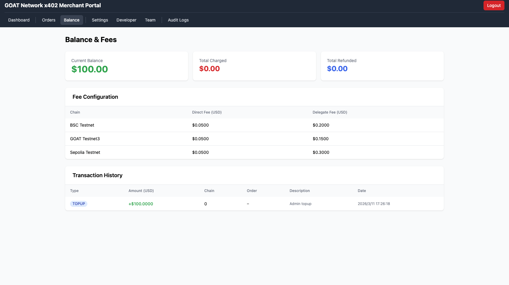

### 13.1 Fee Balance

Fee Balance is your prepaid platform fee balance. Creating x402 orders or QuickPay sessions can fail if the fee balance is insufficient. Successful orders consume fees; expired or canceled orders refund reserved fees according to platform rules.

### 13.2 Self-Service Topup

Use the **Topup** page after approval to create and track fee-balance top-ups. The Topup service creates an x402 order for the requested top-up, tracks the payment, and credits your merchant fee balance through an internal verified callback after the top-up order is invoiced.

| Action | API path |
| --- | --- |
| Create top-up | `POST /api/topup` |
| List top-ups | `GET /api/topup/records` |
| Get one top-up | `GET /api/topup/records/:id` |

### 13.3 Balance Cards

| Card | Description |
| --- | --- |
| **Current Balance** | Current fee balance |
| **Total Charged** | Cumulative fees charged |
| **Total Refunded** | Cumulative refunded fees |

### 13.4 Fee Configuration

Fees are chain/admin configured. The default documentation baseline is:

| Mode | Default baseline |
| --- | ---: |
| DIRECT | `$0.10` per order |
| DELEGATE | `$0.20` per order where supported |

DELEGATE fees are higher because they include authorization processing, TSS
submission, payout, and callback execution overhead. Check the Balance or fee
configuration view for the active chain-specific values before launch.

### 13.5 Transaction History

| Type | Description |
| --- | --- |
| `TOPUP` | Fee-balance top-up credit |
| `CHARGE` | Order or session fee deduction |
| `REFUND` | Returned fee reservation |

---

## 14. Audit Logs

Go to the **Audit Logs** page to view operation records.

The system records operations such as:

- Profile changes
- Receiving address additions and removals
- Callback contract submissions and changes
- Webhook creation, editing, and deletion
- API key rotations
- QuickPay and product changes
- Invite code creation and revocation
- Account security changes
- Login and logout

Each record contains:

| Field | Description |
| --- | --- |
| Action | Operation type |
| Old Value | Value before change |
| New Value | Value after change |
| Actor | Who performed the action |
| IP | Actor's IP address |
| Time | When the action occurred |

---

## Appendix: Quick Start Checklist

Complete the following steps to start accepting payments:

- [ ] 1. Register a merchant account and choose `DIRECT` or `DELEGATE`
- [ ] 2. Wait for admin approval
- [ ] 3. Log in and optionally enable 2FA
- [ ] 4. Add receiving addresses for each accepted Chain + Token
- [ ] 5. For DELEGATE, submit a callback contract on the merchant settlement chain for review
- [ ] 6. Generate API keys and save the API Secret
- [ ] 7. Configure webhook callbacks
- [ ] 8. Top up the fee balance from the Topup page
- [ ] 9. If using QuickPay, enable QuickPay and optionally create Products
- [ ] 10. Integrate the x402 SDK or QuickPay public agent surfaces

```bash
# Install SDKs
npm install goatx402-sdk goatx402-sdk-server

# Backend configuration
GOATX402_API_URL=https://x402-api.goat.network
GOATX402_API_KEY=your_API_Key
GOATX402_API_SECRET=your_API_Secret
```

---

> For questions, please contact the GOAT Network team.

---

Contact email: x402support@goat.network
