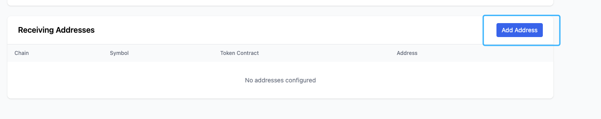
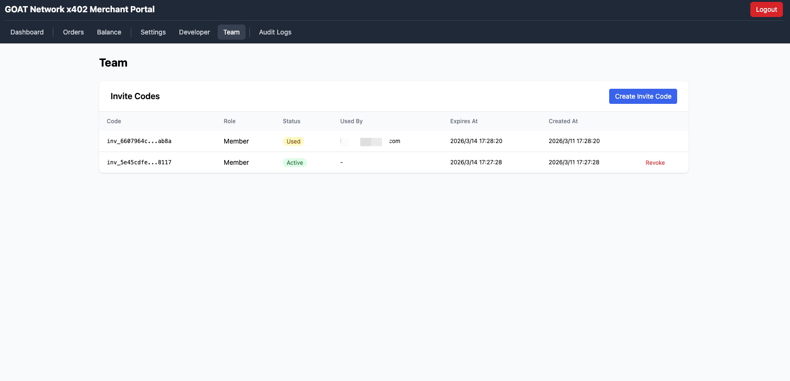
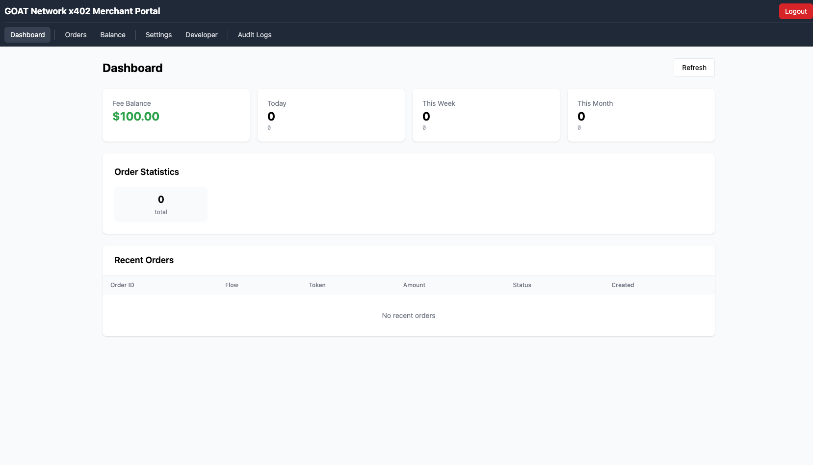

# GOAT x402 Merchant Onboarding Guide

> This guide walks merchants through the complete process of registering, configuring, and managing their GOAT x402 payment integration.

---

## Table of Contents

1. [Overview](#1-overview)
2. [Payment Modes: DIRECT vs DELEGATE](#2-payment-modes-direct-vs-delegate)
3. [Register a Merchant Account (Apply)](#3-register-a-merchant-account-apply)
4. [Approval & Login](#4-approval--login)
5. [Dashboard Overview](#5-dashboard-overview)
6. [Configure Receiving Tokens & Addresses](#6-configure-receiving-tokens--addresses)
7. [Merchant Settings](#7-merchant-settings)
8. [Programmatic API & Webhooks Management](#8-programmatic-api--webhooks-management)
9. [Webhook Configuration](#9-webhook-configuration)
10. [Team Management & Invite Codes](#10-team-management--invite-codes)
11. [Order Management](#11-order-management)
12. [Fee Balance & Fees](#12-fee-balance--fees)
13. [Audit Logs](#13-audit-logs)

---

## 1. Overview

The GOAT x402 Merchant Portal is your management dashboard for:

- Registering and managing your merchant identity
- Configuring receiving tokens, addresses, and supported EVM chains
- Managing API keys and webhook callbacks
- Viewing orders, Fee Balance, and transaction history
- Inviting team members to collaborate

**Access URLs:**
- Merchant Portal: `https://x402-merchant.goat.network`

---

## 2. Payment Modes: DIRECT vs DELEGATE

You must choose one payment mode during registration. **DIRECT and DELEGATE are mutually exclusive and cannot be changed after registration.**

### DIRECT Mode (QuickPay and Direct Payment)

User payments go **directly to your configured merchant receiving address**.

- Available as **QuickPay hosted checkout** with no API key required
- Also available as optional programmatic x402 with HMAC API keys, and **Machine Payments Protocol (MPP)** buyer flows without API keys
- Fund flow: User Wallet → Merchant Receiving Address
- Best for: Tips, donations, simple payments, hosted payment links, and payment-only API access
- Advantages: Simplest integration — QuickPay can be used from the portal, while programmatic DIRECT uses the API/SDK
- Limitations: No MerchantCallback execution through the platform Bob caller

**Example:** A content platform creates a QuickPay link for a creator. Fans pay USDC directly to the creator's configured EVM receiving address. No intermediary settlement address is used.

### DELEGATE Mode (MerchantCallback Execution)

DELEGATE mode is for **programmatic x402 only**. It requires API keys and uses a TSS `payToAddress` as the payment recipient. The buyer SDK transfers the ERC-20 payment to that address. If callback calldata is present, the buyer also signs an EIP-712 callback authorization and the platform **Bob** caller submits it to the merchant's approved `MerchantCallback` contract.

- Fund flow: User Wallet → TSS `payToAddress`
- Optional callback flow: Buyer signs callback authorization → Platform Bob caller → Approved MerchantCallback → Merchant business logic
- Best for: in-game purchases, per-call API billing, NFT minting, and payment-triggered on-chain execution
- Advantages:
  - TSS payment recipient — the buyer SDK transfers ERC-20 tokens to `payToAddress`
  - Optional callback authorization — Bob submits the callback transaction when callback calldata is present
  - Native callbacks — the merchant-owned callback contract executes approved business logic
  - Caller allowlist — only the authorized Bob address can invoke the callback entrypoint
  - Verifiable Proof — every payment generates a settlement proof
  - Platform fee — Core deducts the service fee from the merchant Fee Balance
- Callback execution requirements:
  - Deploy a `MerchantCallback` contract
  - Get the platform Bob address from the platform operator/admin
  - Call `setAuthorizedCaller(bob, true)` on the callback contract
  - Submit the callback contract in the Merchant Portal for admin review

**Example:** A blockchain game deploys a `MerchantCallback` contract for item purchases, authorizes the platform Bob caller with `setAuthorizedCaller(bob, true)`, and submits the contract for review. A player pays ERC-20 tokens to the TSS `payToAddress`; if the order includes callback calldata, the player also signs the callback authorization, Bob submits it to the approved callback, and the game mints the item after payment verification.

### Comparison Table

| Feature | DIRECT | DELEGATE |
|---------|--------|----------|
| Fund Flow | User → Merchant receiving address | User → TSS `payToAddress` |
| Hosted QuickPay | ✅ No API key required | ❌ Not supported |
| Programmatic API | Optional x402 with HMAC API keys; MPP buyer flows without API keys | ✅ Required x402 with HMAC API keys |
| Contract Callback | Not supported | ✅ Optional MerchantCallback execution when callback calldata is present |
| Gas Sponsorship | Not supported | ✅ Bob-submitted callback transaction for callback execution |
| Settlement Proof | Not supported | ✅ Verifiable Proof |
| Integration Difficulty | ⭐ Simplest | ⭐⭐ Requires API keys; callback execution requires callback contract, Bob authorization, and admin review |
| Best For | Tips, donations, simple payments, QuickPay, Machine Payments Protocol (MPP) buyer flows | Games, API billing, NFT minting, payment-triggered execution |

> **Recommendation:** Choose DIRECT if your DApp only needs QuickPay, payment-only x402, or Machine Payments Protocol (MPP) buyer flows. Choose DELEGATE if your programmatic x402 flow needs TSS payment handling and optional MerchantCallback execution.
>
> In short: **DIRECT is for receiving money. DELEGATE is for receiving money + triggering actions.**

---

## 3. Register a Merchant Account (Apply)

### 3.1 Open the Registration Page

Visit the Merchant Portal and click the **Apply** tab to access the registration form.


### 3.2 Fill in Registration Details


Fill in the following fields:

| Field | Description | Format Requirements |
|-------|-------------|---------------------|
| **Merchant ID** | Unique merchant identifier, cannot be changed after registration | Letters, numbers, underscores, and hyphens only. **No spaces allowed.** Reserved IDs and the `topup-` prefix are not allowed. Example: `Test_1`, `My-Shop_01` |
| **Merchant Name** | Display name, can be changed later | Any text |
| **Receive Type** | Payment mode | Select `DIRECT` or `DELEGATE` from dropdown (see Section 2) |
| **Email** | Login email | Valid email address |
| **Password** | Login password | Recommended: 8+ characters with letters and numbers |

> ⚠️ **Merchant ID Format:** English letters, numbers, underscores (`_`), and hyphens (`-`) are allowed. **No spaces or other special characters.** Reserved IDs and IDs beginning with `topup-` are rejected. Examples: `Tarot_App`, `Game-Store_01`. Cannot be changed once registered.

### 3.3 Submit Application

Click **Submit Application** when done.

After submission, the system will display "Waiting for admin approval." You cannot log in until approved. For security, login attempts before approval return the same generic invalid-login message used for failed credentials.

---

## 4. Approval & Login

### 4.1 Admin Approval

After registration, a GOAT x402 administrator will review your application, typically within 24 hours. You will be notified once approved.

### 4.2 Login

Once approved, open the Merchant Portal and switch to the **Login** tab.


Enter the email and password you used during registration, then click **Login** to access the dashboard.

---

## 5. Dashboard Overview

After login, you'll land on the Dashboard page.


The Dashboard displays:

| Card | Description |
|------|-------------|
| **Fee Balance** | Current Fee Balance (for platform transaction fees) |
| **Today** | Today's order count and volume |
| **This Week** | This week's order count and volume |
| **This Month** | This month's order count and volume |

Below the cards:
- **Order Statistics** — Total order count
- **Recent Orders** — Latest orders list

New merchants will show all zeros — this is normal.

---

## 6. Configure Receiving Tokens & Addresses

Go to **Payment Setup → Receiving Tokens & Addresses**.

### 6.1 Initial State

New merchants have no receiving tokens or addresses configured.



### 6.2 Add a Receiving Token & Address

Click **Add Address** in the top right to open the form.


Fill in:

| Field | Description |
|-------|-------------|
| **Chain** | Select a chain (e.g., GOAT Testnet3, BSC Testnet) |
| **Token** | Select a token (e.g., USDC, USDT) |
| **Address** | Your EVM receiving address (`0x` + 40 hex characters) |

> ⚠️ **Important:**
> - Each Chain + Token combination can only have one address — duplicates will be rejected
> - Address must be a valid EVM address (`0x` + 40 hex)
> - Available chain and token configuration depends on the merchant setup and current platform support matrix

### 6.3 View Added Tokens & Addresses

After adding, receiving tokens and addresses appear in the list.


The list shows each address's chain, token, token contract, and receiving address. Click **Remove** (red text) to delete an address.

---

## 7. Merchant Settings

Go to **Merchant Settings** to view and edit merchant information.


### Profile Information

| Field | Editable | Description |
|-------|----------|-------------|
| Merchant ID | ❌ Read-only | Set during registration |
| Receive Type | ❌ Read-only | DIRECT or DELEGATE |
| Status | ❌ Read-only | Enabled / Disabled |
| Role | ❌ Read-only | Owner or Member |
| Name | ✅ Editable | Merchant display name |
| Logo URL | ✅ Editable | Merchant logo image URL |

Click **Save Changes** after modifications.

### Cross-chain Limits

The Merchant Settings page also displays EVM-chain limit configuration:

- `max_frozen_amount_usd` — Maximum frozen amount (USD)
- `max_pending_orders` — Maximum pending orders

These limits are set by Admin and cannot be modified by merchants.

---

## 8. Programmatic API & Webhooks Management

Go to the **Programmatic API & Webhooks** page to view and manage API keys.


### After Rotation

After clicking **Rotate API Keys**, the system generates new keys and displays a prompt. The API Key and API Secret are only shown in full at this moment — save them immediately.


### API Keys Fields

| Field | Description |
|-------|-------------|
| **API Key** | Public key for identifying your merchant |
| **API Secret** | Private key for HMAC signature verification. **Shown only once when generated** |
| **Last Updated** | Last rotation timestamp |

### Instructions

1. On first visit, click **Rotate API Keys** to generate keys
2. **Save the API Secret immediately** — it's only shown once
3. Clicking Rotate again generates new keys — **old keys are invalidated immediately**
4. Use the API Key and API Secret in your backend SDK configuration:

```
GOATX402_API_KEY=your_API_Key
GOATX402_API_SECRET=your_API_Secret
```

> ⚠️ **Security Warning:**
> - API Secret belongs on the backend only — **never expose it in frontend code or public repositories**
> - If you suspect a key leak, Rotate immediately to generate new keys

---

## 9. Webhook Configuration

Webhooks notify you when supported events occur. The current supported event is `order.invoiced`, and delivery is attempted up to 3 times.

### 9.1 Add a Webhook

On the **Programmatic API & Webhooks** page, click **Add Webhook**.


| Field | Description |
|-------|-------------|
| **URL** | Your callback URL. **Must be HTTPS for public merchants.** Example: `https://your-app.com/api/x402/callback` |
| **Events** | Check the events to subscribe to. Currently supports `order.invoiced` (order settled) |

> ⚠️ **Restrictions:**
> - URL must be HTTPS for public merchants. HTTP is allowed only for explicitly configured internal merchants.
> - `localhost` URLs are not allowed (SSRF protection)
> - Maximum **3 webhooks** per merchant

### 9.2 Save the Webhook Secret

After creation, the system displays the **Webhook Secret**.


> ⚠️ **The Webhook Secret is shown only once!** Copy and save it immediately. It's used to verify that incoming webhook requests are genuinely from the GOAT x402 system and prevent forgery.

### 9.3 Manage Webhooks

After creation, you can see each webhook's URL, Events, and status (Active/Disabled) in the list. You can:

- **Edit** — Change URL or toggle enabled/disabled
- **Delete** — Remove the webhook

---

## 10. Team Management & Invite Codes

Merchant Owners can invite others to join the team. Invited members have **read-only access** — they can view Dashboard, Orders, and Fee Balance, but **cannot modify** any merchant configuration.

### 10.1 Role Permission Comparison

| Feature | Owner | Member |
|---------|-------|--------|
| View Dashboard | ✅ | ✅ |
| View Orders | ✅ | ✅ |
| View Fee Balance | ✅ | ✅ |
| Modify Settings (Profile, Receiving Tokens & Addresses, etc.) | ✅ | ❌ |
| Manage API Keys | ✅ | ❌ |
| Manage Webhooks | ✅ | ❌ |
| Manage Team / Invite Codes | ✅ | ❌ |
| View Audit Logs | ✅ | ✅ |

> Members will **not see the Team menu** in the navigation bar and cannot see any edit buttons for Receiving Tokens & Addresses.

### 10.2 Create an Invite Code (Owner)

Go to the **Team** page and click **Create Invite Code**.


- Invite code role is fixed as **Member**
- Expiration defaults to **72 hours** (3 days), adjustable
- Each invite code is **single-use only**

### 10.3 Copy the Invite Code

After creation, the system displays the full invite code.


> ⚠️ **The full invite code is shown only once!** Click **Copy** immediately and share it with the invitee.

### 10.4 Invite Code Status Management



Invite codes have three possible statuses:

| Status | Description |
|--------|-------------|
| **Active** (green) | Unused, can be shared. Owner can click **Revoke** to cancel |
| **Used** (blue) | Already used, shows the user's email |
| **Revoked** | Cancelled, can no longer be used |

### 10.5 Invitee Registration (Member)

The invitee opens the Merchant Portal and switches to the **Invite** tab.


Fill in:
- **Invite Code** — The code provided by the Owner
- **Email** — Your own email
- **Password** — Set a login password

Click **Register** to complete registration. Invite code registration **does not require Admin approval** — you can log in immediately after registration.

### 10.6 Member After Login

Members can see Dashboard, Orders, Fee Balance, and other pages, but the navigation bar has no Team menu and no edit buttons are visible for any configuration.



---

## 11. Order Management

Go to the **Orders** page to view all orders.


### Filters

| Filter | Options |
|--------|---------|
| **Status** | All / Various order statuses |
| **Flow** | All / DIRECT / DELEGATE |

Click **Reset** to clear all filters.

### Order List Fields

| Column | Description |
|--------|-------------|
| ID | System order ID |
| Dapp Order | DApp-side order number |
| Flow | DIRECT or DELEGATE |
| Token | Payment token (e.g., USDC) |
| Amount | Payment amount |
| User | Payer's address (blue link, click to view on Explorer) |
| Status | Order status |
| Created | Creation time |

Click **View** to see order details, including on-chain payment and callback transaction information.

---

## 12. Fee Balance & Fees

Go to the **Fee Balance** page to view fee-related information.


### What is Fee Balance?

Fee Balance is your **prepaid USD balance for platform fees**. The system charges the configured fee when an order is created. If the order expires or is canceled, the fee is refunded to your Fee Balance. When the balance is insufficient, new payment requests cannot be processed.

### How to Fee Top-up?

After your merchant registration is approved, contact the GOAT x402 team to complete your initial Fee Top-up:

1. **Contact the GOAT x402 team** with your Merchant ID
2. **Agree on a Fee Top-up amount** — the team will recommend an amount based on your business estimate
3. **After payment**, Admin will credit your Fee Balance in the backend
4. Once credited, the Fee Balance page will show your updated balance, and Transaction History will show a Fee Top-up record

> 💡 **Testnet:** On testnet, Admin directly credits approved merchants with a test balance (e.g., $100) — no actual payment required.
>
> 💡 **Mainnet:** On mainnet, Fee Top-ups are also handled by Admin. Please contact the GOAT x402 team.

### Fee Balance Cards

| Card | Description |
|------|-------------|
| **Fee Balance** | Current Fee Balance (green) — charged when orders are created |
| **Total Charged** | Cumulative fees charged (red) — total historical fees |
| **Total Refunded** | Cumulative refunds (blue) — fees returned from order refunds |

### Fee Configuration

Fees are configured per chain by Admin. The platform defaults are typically **$0.10 per DIRECT order** and **$0.20 per DELEGATE order**, but actual values can vary by chain configuration. DELEGATE fees are higher than DIRECT because they include Bob-submitted callback execution services.

### Transaction History

Lists all fee-related transactions:

| Type | Description |
|------|-------------|
| **Fee Top-up** | Fee top-up records (Admin operation) |
| **CHARGE** | Order fee deductions |
| **REFUND** | Refund returns |

---

## 13. Audit Logs

Go to the **Audit Logs** page to view all operation records.

The system automatically records the following operations:

- Profile changes (name, logo)
- Receiving address additions and removals
- Webhook creation, editing, and deletion
- API Key rotations
- Invite code creation and revocation
- Login and logout

Each record contains:

| Field | Description |
|-------|-------------|
| Action | Operation type |
| Old Value | Value before change |
| New Value | Value after change |
| Actor | Who performed the action |
| IP | Actor's IP address |
| Time | When the action occurred |

---

## Appendix: Quick Start Checklist

Complete the following steps to start accepting payments:

- [ ] 1. Register a merchant account (choose DIRECT or DELEGATE mode)
- [ ] 2. Wait for Admin approval
- [ ] 3. Log in to the portal
- [ ] 4. Add receiving tokens and addresses (at least one Chain + Token)
- [ ] 5. Generate API Keys and save the API Secret if using programmatic x402 or DELEGATE
- [ ] 6. Configure webhook callback URL
- [ ] 7. Integrate x402 SDK in your DApp backend

```bash
# Install SDK
npm install goatx402-sdk goatx402-sdk-server

# Backend configuration
GOATX402_API_URL=https://x402-api.goat.network
GOATX402_API_KEY=your_API_Key
GOATX402_API_SECRET=your_API_Secret
```

---

> For questions, please contact the GOAT Network team.

---

Contact email: x402support@goat.network
