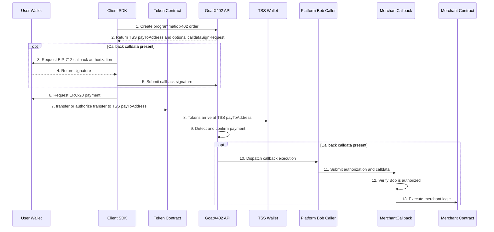

# GOAT x402 Integration Guide

## Table of Contents

1. [Overview](#1-overview)
2. [Quick Start (10 minutes)](#2-quick-start-10-minutes)
3. [Architecture & System Structure](#3-architecture--system-structure)
4. [Two Payment Modes Explained](#4-two-payment-modes-explained)
5. [Fee Model](#5-fee-model)
6. [Backend Integration (Server SDK)](#6-backend-integration-server-sdk)
7. [Frontend Integration (Client SDK)](#7-frontend-integration-client-sdk)
8. [Security & Authentication Model](#8-security--authentication-model)
9. [API Reference](#9-api-reference)
10. [Error Handling & Troubleshooting](#10-error-handling--troubleshooting)
11. [Versioning & Compatibility](#11-versioning--compatibility)
12. [Best Practices](#12-best-practices)
13. [Appendix](#13-appendix)
14. [Gaps & TODOs](#14-gaps--todos)

---

## 1. Overview

### 1.1 What is GoatX402

GOAT x402 is an EVM-only payment infrastructure for merchants, applications, and agent-oriented workflows. It provides two payment receiving modes to meet different merchant needs.

### 1.2 SDK Components

| SDK | Purpose | Package |
|-----|---------|---------|
| **goatx402-sdk** | Frontend client SDK | `npm install goatx402-sdk` |
| **goatx402-sdk-server-ts** | TypeScript backend SDK | `npm install goatx402-sdk-server` |
| **goatx402-sdk-server-go** | Go backend SDK | `go get github.com/goatnetwork/goatx402-sdk-server` |

### 1.3 Two Payment Modes

| Mode | Identifier | Receiving Method | Fixed Fee | Use Case |
|------|------------|------------------|-----------|----------|
| **Direct Mode** | `DIRECT` | User transfers directly to merchant receiving address | Lower (e.g., $0.10/tx) | QuickPay, simple payments, Machine Payments Protocol (MPP) buyer flows, no callbacks |
| **Delegate Mode** | `DELEGATE` | User transfers ERC-20 to TSS `payToAddress`; optional Bob callback authorization | Higher (e.g., $0.20/tx) | Programmatic x402 callbacks, complex business logic |

DIRECT and DELEGATE are mutually exclusive and fixed at merchant registration.

### 1.4 Supported Blockchain Networks

Supported chains are DB/config-driven and can vary by merchant. Checked-in examples include Ethereum `1`, Base `8453`, Arbitrum `42161`, BSC `56`, and Metis `1088` for mainnet receiving configuration; Tempo `4217` / `42431` for MPP examples; and GOAT Testnet3 `48816`, BSC Testnet `97`, and Sepolia `11155111` in repository testnet seeds.

Do not hardcode a static chain matrix in application code. Read supported chains, tokens, contract addresses, confirmations, and RPCs from the merchant/Core configuration.

---

## 2. Quick Start (10 minutes)

### 2.1 Prerequisites

1. **Merchant Account**: Contact GoatX402 to obtain
2. **API Credentials**: `API_KEY` and `API_SECRET` for HMAC-authenticated programmatic x402, including DELEGATE
3. **Fee Balance**: Ensure sufficient USD Fee Balance
4. **DELEGATE callback setup**: If callback calldata is used, deploy `MerchantCallback`, get the platform Bob address from the operator/admin, call `setAuthorizedCaller(bob, true)`, and submit it for admin review

Machine Payments Protocol (MPP) buyer `/mpp/v1/challenge` and `/mpp/v1/verify` calls do not use merchant API keys. MPP route configuration is managed separately through merchant JWT-authenticated portal APIs.

### 2.2 Installation

```bash
# Backend SDK
npm install goatx402-sdk-server

# Frontend SDK
npm install goatx402-sdk ethers
```

### 2.3 Backend: Create Order

```typescript
import { GoatX402Client } from 'goatx402-sdk-server'

// Initialize client
const client = new GoatX402Client({
  baseUrl: 'https://x402-api.goat.network',
  apiKey: process.env.GOATX402_API_KEY,
  apiSecret: process.env.GOATX402_API_SECRET,
})

// Create payment order
async function createOrder(userId: string, amount: string) {
  const order = await client.createOrder({
    dappOrderId: `order_${Date.now()}`,  // Merchant order ID
    chainId: 8453,                        // Example configured chain: Base
    tokenSymbol: 'USDC',
    tokenContract: '0xConfiguredTokenContract',
    fromAddress: '0xUserWalletAddress',   // User wallet address
    amountWei: '10000000',                // 10 USDC (6 decimals)
    // callbackCalldata: '0x...',         // Optional: callback data (delegate mode only)
  })

  return order
}
```

### 2.4 Frontend: Execute Payment

```typescript
import { PaymentHelper } from 'goatx402-sdk'
import { ethers } from 'ethers'

async function executePayment(order: Order) {
  // Connect wallet
  const provider = new ethers.BrowserProvider(window.ethereum)
  const signer = await provider.getSigner()
  const payment = new PaymentHelper(signer)

  // If callback sign request exists (delegate mode), sign first
  if (order.calldataSignRequest) {
    const signature = await payment.signCalldata(order)
    await submitSignatureToBackend(order.orderId, signature)
  }

  // Execute payment
  const result = await payment.pay(order)

  if (result.success) {
    console.log('Payment successful:', result.txHash)
  }
}
```

### 2.5 Verify Integration

```typescript
// Query order status
const status = await client.getOrderStatus(orderId)

// Order status flow
// CHECKOUT_VERIFIED → PAYMENT_CONFIRMED → INVOICED
```

---

## 3. Architecture & System Structure

### 3.1 System Architecture

```
┌─────────────────────────────────────────────────────────────────┐
│                      Merchant System                             │
│  ┌──────────────────┐        ┌──────────────────┐              │
│  │  Merchant Backend │        │ Merchant Frontend │              │
│  │  (Server SDK)     │        │  (Client SDK)     │              │
│  └────────┬─────────┘        └────────┬─────────┘              │
└───────────┼────────────────────────────┼────────────────────────┘
            │                            │
            │ HMAC Signature Auth        │ Wallet Interaction
            ▼                            ▼
┌───────────────────────────────────────────────────────────────────┐
│                      GoatX402 Platform                             │
│  ┌─────────────┐  ┌─────────────┐  ┌─────────────┐              │
│  │  API Gateway │  │ Payment Eng │  │ Bob Relayer │              │
│  └─────────────┘  └─────────────┘  └─────────────┘              │
│                                                                  │
│  ┌─────────────┐  ┌─────────────┐  ┌─────────────┐              │
│  │ EVM Watcher │  │ Callback Svc│  │ Fee System  │              │
│  └─────────────┘  └─────────────┘  └─────────────┘              │
└───────────────────────────────────────────────────────────────────┘
            │                            │
            ▼                            ▼
┌───────────────────────────────────────────────────────────────────┐
│                      Blockchain Networks                          │
│  ┌──────────┐  ┌──────────┐  ┌──────────┐  ┌──────────┐        │
│  │ Ethereum │  │   Base   │  │ Arbitrum │  │   BSC    │        │
│  └──────────┘  └──────────┘  └──────────┘  └──────────┘        │
└───────────────────────────────────────────────────────────────────┘
```

### 3.2 Data Flow Overview


---

## 4. Two Payment Modes Explained

### 4.1 Direct Mode (DIRECT)

**Overview**: User directly transfers tokens to the merchant receiving address. DIRECT also supports QuickPay hosted checkout without API keys, programmatic x402 with HMAC API keys, and Machine Payments Protocol (MPP) buyer flows without merchant API keys.

**Features**:
- Simplest payment method
- Lowest fixed fee
- Pays the merchant receiving address directly
- No callback support

**Payment Flow**:


**Flow Types**: `ERC20_DIRECT`

**Code Example**:

```typescript
// Backend creates order
const order = await client.createOrder({
  dappOrderId: 'order_001',
  chainId: 8453,
  tokenSymbol: 'USDC',
  tokenContract: '0xConfiguredTokenContract',
  fromAddress: userWallet,
  amountWei: '10000000',
  // No callbackCalldata - Direct mode
})

// order.flow = 'ERC20_DIRECT'
// order.payToAddress = Merchant receiving address
```

---

### 4.2 Delegate Mode (DELEGATE)

**Overview**: DELEGATE is programmatic x402 only. The order `payToAddress` is a TSS wallet, and the buyer SDK transfers the ERC-20 payment to that address. If callback calldata is present, the buyer also signs an EIP-712 callback authorization, and the platform Bob caller submits it to the merchant's approved `MerchantCallback` contract.

**Features**:
- Supports callback functionality (execute merchant contracts)
- Higher fixed fee (includes Bob-submitted callback execution overhead)
- Requires API keys
- Uses a TSS wallet as the ERC-20 payment recipient
- Callback execution requires a deployed `MerchantCallback` contract
- Callback execution requires Bob authorization with `setAuthorizedCaller(bob, true)`, using the Bob address supplied by the platform operator/admin
- Callback execution requires Merchant Portal admin review before launch
- Supports complex business logic

**Payment Flow**:



**Flow Types**: `ERC20_3009`, `ERC20_APPROVE_XFER`

**Code Example**:

```typescript
// Backend creates order (with callback)
const order = await client.createOrder({
  dappOrderId: 'order_002',
  chainId: 8453,
  tokenSymbol: 'USDC',
  tokenContract: '0xConfiguredTokenContract',
  fromAddress: userWallet,
  amountWei: '10000000',
  callbackCalldata: '0x...', // Callback data (optional)
})

// order.flow = 'ERC20_3009' or 'ERC20_APPROVE_XFER'
// order.payToAddress = TSS wallet address
// order.calldataSignRequest = EIP-712 callback sign request (if callback exists)
// If callbackCalldata is used, MerchantCallback must authorize Bob with setAuthorizedCaller(bob, true)
```

---

### 4.3 Mode Comparison

| Feature | Direct Mode (DIRECT) | Delegate Mode (DELEGATE) |
|---------|----------------------|--------------------------|
| **Receiving Target** | Merchant receiving address | TSS `payToAddress`; optional MerchantCallback via platform Bob caller |
| **Fixed Fee** | Lower (e.g., $0.10) | Higher (e.g., $0.20) |
| **Funds Arrival** | Immediate after user transfer | After ERC-20 transfer to TSS `payToAddress` confirms |
| **Callback Support** | ❌ Not supported | ✅ Optional when callback calldata is present |
| **API Keys** | Required for programmatic x402; not required for QuickPay or MPP buyer challenge/verify | ✅ Required |
| **Bob Authorization** | Not used | Required when callback calldata is present |
| **Use Case** | Simple payments | Complex business logic |
| **Gas Cost** | User transfer gas | User payment gas or token authorization; Bob callback gas included in service fee when callback is used |

---

## 5. Fee Model

### 5.1 Fee Structure

GoatX402 uses a **fixed fee** model (not percentage). The fee is charged when an order is created and refunded if the order expires or is canceled.

| Fee Type | Direct Mode | Delegate Mode | Description |
|----------|-------------|---------------|-------------|
| Order Fee | `fee_usd_direct` | `fee_usd_delegate` | Fixed USD fee configured per chain |
| Default Fee | $0.10/tx | $0.20/tx | Customizable per chain |

**Why is Delegate Mode fee higher?**
- Platform Bob submits callback execution
- Additional on-chain gas cost for callback execution
- Admin-reviewed MerchantCallback operations

### 5.2 Fee Balance System

Merchants need to **pre-fund a USD Fee Balance**, deducted when orders are created.

```
┌─────────────────────────────────────────────────────┐
│                Fee Balance Flow                      │
├─────────────────────────────────────────────────────┤
│                                                     │
│  1. Fee Top-up → merchant_fee_balance += $100       │
│                                                     │
│  2. Create order → Check balance                    │
│     ├─ Insufficient → Return HTTP 400 error         │
│     └─ Sufficient → Charge fee, create order        │
│                                                     │
│  3. Payment successful → Fee consumed (no refund)   │
│                                                     │
│  4. Order expired/canceled → Fee refunded           │
│                                                     │
└─────────────────────────────────────────────────────┘
```

QuickPay may surface fee-balance unavailability as HTTP `503`. HTTP `402` is the expected successful Payment Required response for programmatic order creation, not the insufficient-fee error.

### 5.3 Fee Calculation Examples

```typescript
// Direct mode order
const directOrder = {
  chainId: 8453, // Example configured chain: Base
  mode: 'DIRECT',
  fee: '$0.10',  // Default; actual fee is per-chain config
}

// Delegate mode order
const delegateOrder = {
  chainId: 8453, // Example configured chain: Base
  mode: 'DELEGATE',
  fee: '$0.20',  // Default; actual fee is per-chain config
}

// Whether order amount is $10 or $10,000, fee is fixed
```

### 5.4 Insufficient Fee Balance Handling

```typescript
try {
  const order = await client.createOrder(orderParams)
} catch (error) {
  if (error.status === 400 || error.status === 503) {
    // Fee balance insufficient
    console.error('Insufficient Fee Balance, please contact operator for Fee Top-up')
    // error.message: "Insufficient fee balance"
  }
}
```

---

## 6. Backend Integration (Server SDK)

### 6.1 Initialization

```typescript
import { GoatX402Client } from 'goatx402-sdk-server'

const client = new GoatX402Client({
  baseUrl: process.env.GOATX402_API_URL,    // API URL
  apiKey: process.env.GOATX402_API_KEY,      // API Key
  apiSecret: process.env.GOATX402_API_SECRET, // API Secret
})
```

### 6.2 Create Order

```typescript
interface CreateOrderParams {
  dappOrderId: string       // Merchant order ID (unique)
  chainId: number           // Chain ID
  tokenSymbol: string       // Token symbol
  tokenContract: string     // Token contract address
  fromAddress: string       // Payer address
  amountWei: string         // Amount (smallest unit)
  callbackCalldata?: string // Callback data (delegate mode optional)
}

const order = await client.createOrder({
  dappOrderId: `order_${Date.now()}`,
  chainId: 8453,
  tokenSymbol: 'USDC',
  tokenContract: '0xConfiguredTokenContract',
  fromAddress: '0x742d35Cc6634C0532925a3b844Bc...',
  amountWei: '10000000', // 10 USDC
})
```

### 6.3 Order Response

```typescript
interface OrderResponse {
  orderId: string                  // GoatX402 order ID
  flow: PaymentFlow                // Payment flow type
  payToAddress: string             // Receiving address
  expiresAt: number                // Expiration time (Unix timestamp)
  calldataSignRequest?: {          // EIP-712 sign request (if callback exists)
    domain: EIP712Domain
    types: Record<string, EIP712Type[]>
    primaryType: string
    message: SignMessage
  }
}
```

### 6.4 Query Order Status

```typescript
const status = await client.getOrderStatus(orderId)

// status.status possible values:
// - 'CHECKOUT_VERIFIED'  : Awaiting payment
// - 'PAYMENT_CONFIRMED'  : Payment confirmed
// - 'INVOICED'           : Complete (invoiced)
// - 'EXPIRED'            : Expired
// - 'FAILED'             : Failed
```

### 6.5 Submit Callback Signature

```typescript
// After user signs on frontend, submit to backend
await client.submitCalldataSignature(orderId, '0x...') // User's EIP-712 signature
```

### 6.6 Get Payment Proof

```typescript
// Get proof after payment completion
const proof = await client.getPaymentProof(orderId)

// proof contains on-chain tx hash and GoatX402 signature proof
```

---

## 7. Frontend Integration (Client SDK)

### 7.1 Installation & Initialization

```typescript
import { PaymentHelper, ERC20Token, parseUnits, formatUnits } from 'goatx402-sdk'
import { ethers } from 'ethers'

// Connect wallet
const provider = new ethers.BrowserProvider(window.ethereum)
await provider.send('eth_requestAccounts', [])
const signer = await provider.getSigner()

// Create PaymentHelper
const payment = new PaymentHelper(signer)
```

### 7.2 Complete Payment Flow

```typescript
async function processPayment(order: Order) {
  const provider = new ethers.BrowserProvider(window.ethereum)
  const signer = await provider.getSigner()
  const payment = new PaymentHelper(signer)

  // 1. Verify network
  const network = await provider.getNetwork()
  if (Number(network.chainId) !== order.chainId) {
    await provider.send('wallet_switchEthereumChain', [
      { chainId: `0x${order.chainId.toString(16)}` },
    ])
  }

  // 2. Check balance
  const balance = await payment.getTokenBalance(order.tokenContract)
  const required = BigInt(order.amountWei)
  if (balance < required) {
    throw new Error('Insufficient balance')
  }

  // 3. If callback sign request exists (delegate mode), sign first
  if (order.calldataSignRequest) {
    const signature = await payment.signCalldata(order)
    // Submit signature to backend
    await fetch('/api/orders/sign', {
      method: 'POST',
      headers: { 'Content-Type': 'application/json' },
      body: JSON.stringify({ orderId: order.orderId, signature }),
    })
  }

  // 4. Execute payment
  const result = await payment.pay(order)

  if (result.success) {
    console.log('Transaction hash:', result.txHash)
    // Notify backend payment initiated
    await fetch('/api/orders/notify', {
      method: 'POST',
      body: JSON.stringify({ orderId: order.orderId, txHash: result.txHash }),
    })
  }

  return result
}
```

### 7.3 React Hook Example

```typescript
// hooks/useGoatX402Payment.ts
import { useState, useCallback } from 'react'
import { PaymentHelper, Order, PaymentResult } from 'goatx402-sdk'
import { ethers } from 'ethers'

export function useGoatX402Payment() {
  const [loading, setLoading] = useState(false)
  const [error, setError] = useState<string | null>(null)

  const pay = useCallback(async (order: Order): Promise<PaymentResult | null> => {
    setLoading(true)
    setError(null)

    try {
      const provider = new ethers.BrowserProvider(window.ethereum)
      const signer = await provider.getSigner()
      const payment = new PaymentHelper(signer)

      // Handle callback signature
      if (order.calldataSignRequest) {
        const sig = await payment.signCalldata(order)
        await submitSignature(order.orderId, sig)
      }

      const result = await payment.pay(order)

      if (!result.success) {
        setError(result.error || 'Payment failed')
      }

      return result
    } catch (err: any) {
      const msg = err.code === 'ACTION_REJECTED'
        ? 'User cancelled operation'
        : err.message
      setError(msg)
      return null
    } finally {
      setLoading(false)
    }
  }, [])

  return { pay, loading, error }
}
```

### 7.4 Pay Button Component

```tsx
// components/PayButton.tsx
import { useGoatX402Payment } from '../hooks/useGoatX402Payment'
import { Order } from 'goatx402-sdk'

interface PayButtonProps {
  order: Order
  onSuccess: (txHash: string) => void
  onError: (error: string) => void
}

export function PayButton({ order, onSuccess, onError }: PayButtonProps) {
  const { pay, loading, error } = useGoatX402Payment()

  const handleClick = async () => {
    const result = await pay(order)
    if (result?.success && result.txHash) {
      onSuccess(result.txHash)
    } else if (result?.error) {
      onError(result.error)
    }
  }

  return (
    <button onClick={handleClick} disabled={loading}>
      {loading ? 'Processing...' : `Pay ${formatAmount(order)}`}
    </button>
  )
}
```

---

## 8. Security & Authentication Model

### 8.1 Backend API Authentication (HMAC-SHA256)

```typescript
// Server SDK handles signature automatically
// Signature algorithm:
// 1. Combine query args, body params, api_key, timestamp, and nonce
// 2. Sort params by key
// 3. Concatenate: key1=value1&key2=value2
// 4. HMAC-SHA256(secret, payload)

// Request headers:
// X-API-Key: {apiKey}
// X-Timestamp: {unixSeconds}
// X-Nonce: {uniqueRequestNonce}
// X-Sign: {hmacSignature}
```

### 8.2 EIP-712 Signature (Callback Authorization)

```typescript
// User signature authorizes callback execution when callback calldata exists.
// Use the calldataSignRequest returned by the order; do not hardcode these values.
const signRequest: CalldataSignRequest = {
  domain: {
    name: 'GoatX402 Pay Callback',
    version: '1',
    chainId: 8453,
    verifyingContract: '0xCallbackContract...',
  },
  types: {
    Eip3009CallbackData: [
      { name: 'token', type: 'address' },
      { name: 'owner', type: 'address' },
      { name: 'payer', type: 'address' },
      { name: 'amount', type: 'uint256' },
      { name: 'orderId', type: 'bytes32' },
      { name: 'calldataNonce', type: 'uint256' },
      { name: 'deadline', type: 'uint256' },
      { name: 'calldataHash', type: 'bytes32' },
    ],
  },
  primaryType: 'Eip3009CallbackData',
  message: {
    token: '0xConfiguredTokenContract',
    owner: '0xTssPayToAddress',
    payer: '0xUserAddress',
    amount: '10000000',
    orderId: '0xOrderIdHash',
    calldataNonce: '1',      // Anti-replay
    deadline: '1704067200',  // Expiration time
    calldataHash: '0x...',   // Callback data hash
  },
}
```

For DELEGATE integrations with callback calldata, the merchant must also deploy `MerchantCallback`, get the platform Bob address from the platform operator/admin, call `setAuthorizedCaller(bob, true)`, and submit the callback contract in the Merchant Portal for admin review.

### 8.3 Security Mechanisms

| Mechanism | Description |
|-----------|-------------|
| **Nonce** | Each signature unique, prevents replay attacks |
| **Deadline** | Signature validity period, invalid after expiry |
| **Chain ID** | Bound to chain ID, prevents cross-chain replay |
| **Contract Binding** | Bound to contract address, prevents cross-contract replay |
| **Calldata Hash** | Callback data hash, prevents tampering |

---

## 9. API Reference

### 9.1 PaymentHelper Class

| Method | Parameters | Returns | Description |
|--------|------------|---------|-------------|
| `constructor(signer)` | `ethers.Signer` | - | Initialize |
| `getAddress()` | - | `Promise<string>` | Get wallet address |
| `pay(order)` | `Order` | `Promise<PaymentResult>` | Execute payment |
| `signCalldata(order)` | `Order` | `Promise<string>` | Sign callback data |
| `getTokenBalance(token)` | `string` | `Promise<bigint>` | Query token balance |
| `getTokenAllowance(token, spender)` | `string, string` | `Promise<bigint>` | Query allowance |
| `approveToken(token, spender, amount?)` | `string, string, bigint?` | `Promise<TransactionResponse>` | Approve token |

### 9.2 ERC20Token Class

| Method | Parameters | Returns | Description |
|--------|------------|---------|-------------|
| `constructor(address, signerOrProvider)` | `string, Signer|Provider` | - | Initialize |
| `balanceOf(address)` | `string` | `Promise<bigint>` | Query balance |
| `allowance(owner, spender)` | `string, string` | `Promise<bigint>` | Query allowance |
| `decimals()` | - | `Promise<number>` | Get decimals |
| `symbol()` | - | `Promise<string>` | Get symbol |
| `approve(spender, amount)` | `string, bigint` | `Promise<TransactionResponse>` | Approve |
| `transfer(to, amount)` | `string, bigint` | `Promise<TransactionResponse>` | Transfer |
| `ensureApproval(owner, spender, amount)` | `string, string, bigint` | `Promise<{needed, tx?}>` | Ensure approval |

### 9.3 Utility Functions

```typescript
// Amount format conversion
import { parseUnits, formatUnits } from 'goatx402-sdk'

// Human readable → Wei
const amountWei = parseUnits('100.5', 6) // 100500000n

// Wei → Human readable
const amount = formatUnits(100500000n, 6) // "100.5"
```

### 9.4 Type Definitions

```typescript
// Payment flow types
type PaymentFlow =
  | 'ERC20_DIRECT'        // Direct mode
  | 'ERC20_3009'          // Delegate mode (EIP-3009)
  | 'ERC20_APPROVE_XFER'  // Delegate mode (approve and transfer)

// Order status
type OrderStatus =
  | 'CHECKOUT_VERIFIED'   // Awaiting payment
  | 'PAYMENT_CONFIRMED'   // Payment confirmed
  | 'INVOICED'            // Complete
  | 'EXPIRED'             // Expired
  | 'FAILED'              // Failed
  | 'CANCELLED'           // Cancelled while still cancellable

// Order interface
interface Order {
  orderId: string
  flow: PaymentFlow
  tokenSymbol: string
  tokenContract: string
  fromAddress: string
  payToAddress: string
  chainId: number
  amountWei: string
  expiresAt: number
  calldataSignRequest?: CalldataSignRequest
}

// Payment result
interface PaymentResult {
  success: boolean
  txHash?: string
  error?: string
}
```

---

## 10. Error Handling & Troubleshooting

### 10.1 Common Error Codes

| Error Code | Description | Solution |
|------------|-------------|----------|
| `402` | Payment Required success response from order creation | Continue with the x402 payment flow |
| `400` | Request parameter or business rule error, including insufficient Fee Balance for programmatic create | Check parameters or contact operator for Fee Top-up |
| `401` | Authentication failed | Check API Key/Secret and signature |
| `404` | Order not found | Check order ID |
| `409` | Order already exists | dappOrderId duplicate |
| `503` | QuickPay fee unavailable, Bob relay, or callback service unavailable | Retry or contact the platform operator |

### 10.2 Frontend Common Issues

#### Issue 1: Fee Balance Insufficient (HTTP 400 or 503)

```typescript
try {
  const order = await client.createOrder(params)
} catch (error) {
  if (error.status === 400 || error.status === 503) {
    // Display prompt
    alert('Merchant Fee Balance insufficient, please contact admin for Fee Top-up')
  }
}
```

#### Issue 2: User Rejected Transaction

```typescript
try {
  const result = await payment.pay(order)
} catch (error) {
  if (error.code === 'ACTION_REJECTED') {
    console.log('User cancelled transaction')
  }
}
```

#### Issue 3: Token Balance Insufficient

```typescript
const balance = await payment.getTokenBalance(order.tokenContract)
const required = BigInt(order.amountWei)

if (balance < required) {
  const token = new ERC20Token(order.tokenContract, provider)
  const symbol = await token.symbol()
  const decimals = await token.decimals()

  alert(`Insufficient balance: need ${formatUnits(required, decimals)} ${symbol}`)
}
```

#### Issue 4: Network Mismatch

```typescript
const network = await provider.getNetwork()
if (Number(network.chainId) !== order.chainId) {
  try {
    await provider.send('wallet_switchEthereumChain', [
      { chainId: `0x${order.chainId.toString(16)}` },
    ])
  } catch (error) {
    alert('Please switch to correct network')
  }
}
```

#### Issue 5: Order Expired

```typescript
if (Date.now() / 1000 > order.expiresAt) {
  alert('Order expired, please create a new one')
  // Create new order
}
```

### 10.3 Debug Checklist

```typescript
async function debugPayment(order: Order) {
  console.log('=== Payment Debug ===')

  // 1. Wallet connection
  const address = await payment.getAddress()
  console.log('Wallet address:', address)

  // 2. Network check
  const network = await provider.getNetwork()
  console.log('Current network:', network.chainId)
  console.log('Order network:', order.chainId)
  console.log('Network match:', Number(network.chainId) === order.chainId)

  // 3. Order validity
  const now = Date.now() / 1000
  console.log('Current time:', now)
  console.log('Expiration:', order.expiresAt)
  console.log('Order valid:', now < order.expiresAt)

  // 4. Token balance
  const balance = await payment.getTokenBalance(order.tokenContract)
  console.log('Token balance:', balance.toString())
  console.log('Required amount:', order.amountWei)
  console.log('Sufficient:', balance >= BigInt(order.amountWei))

  // 5. Payment mode
  console.log('Payment mode:', order.flow)
  console.log('Pay to address:', order.payToAddress)
  console.log('Signature required:', !!order.calldataSignRequest)

  console.log('=== Debug Complete ===')
}
```

---

## 11. Versioning & Compatibility

### 11.1 SDK Versions

| Package | Current Version | Status |
|---------|-----------------|--------|
| goatx402-sdk | 0.1.0 | Beta |
| goatx402-sdk-server | 0.1.0 | Beta |

### 11.2 Dependency Versions

| Dependency | Version Requirement |
|------------|---------------------|
| ethers | ^6.9.0 |
| typescript | ^5.3.0 |
| node | >=18 |

### 11.3 Browser Compatibility

| Browser | Minimum Version |
|---------|-----------------|
| Chrome | 80+ |
| Firefox | 75+ |
| Safari | 14+ |
| Edge | 80+ |

---

## 12. Best Practices

### 12.1 Backend Best Practices

```typescript
// ✅ Use environment variables
const client = new GoatX402Client({
  baseUrl: process.env.GOATX402_API_URL,
  apiKey: process.env.GOATX402_API_KEY,
  apiSecret: process.env.GOATX402_API_SECRET,
})

// ✅ Validate order amount
function validateAmount(amount: string, minUsd: number, maxUsd: number) {
  const value = parseFloat(amount)
  if (value < minUsd || value > maxUsd) {
    throw new Error(`Amount must be between $${minUsd} - $${maxUsd}`)
  }
}

// ✅ Handle order.invoiced webhook notifications
app.post('/webhook/goatx402', async (req, res) => {
  const { orderId, status, txHash } = req.body

  // Verify signature
  if (!verifyWebhookSignature(req)) {
    return res.status(401).send('Invalid signature')
  }

  // Update order status
  await updateOrderStatus(orderId, status)

  res.status(200).send('OK')
})
```

### 12.2 Frontend Best Practices

```typescript
// ✅ Cache Provider and Signer
let cachedPayment: PaymentHelper | null = null

async function getPaymentHelper() {
  if (!cachedPayment) {
    const provider = new ethers.BrowserProvider(window.ethereum)
    const signer = await provider.getSigner()
    cachedPayment = new PaymentHelper(signer)
  }
  return cachedPayment
}

// ✅ Display user-friendly errors
function getErrorMessage(error: any): string {
  if (error.code === 'ACTION_REJECTED') return 'You cancelled the transaction'
  if (error.message?.includes('insufficient')) return 'Insufficient balance'
  if (error.status === 400 || error.status === 503) return 'Merchant Fee Balance insufficient'
  return 'Payment failed, please try again'
}

// ✅ Transaction status tracking
function PaymentStatus({ txHash, chainId }: { txHash: string, chainId: number }) {
  const explorerUrl = getExplorerUrl(chainId, txHash)
  return (
    <a href={explorerUrl} target="_blank">
      View transaction details
    </a>
  )
}
```

### 12.3 Security Best Practices

```typescript
// ✅ Get order from backend, don't construct on frontend
const order = await fetch('/api/orders', {
  method: 'POST',
  body: JSON.stringify({ productId }),
}).then(r => r.json())

// ✅ Validate order expiration
if (Date.now() / 1000 > order.expiresAt) {
  throw new Error('Order expired')
}

// ✅ Validate payer address
if (order.fromAddress.toLowerCase() !== userAddress.toLowerCase()) {
  throw new Error('Order address mismatch')
}

// ❌ Don't hardcode amounts on frontend
const order = { amountWei: '1000000' } // Dangerous!

// ❌ Don't store sensitive info
localStorage.setItem('apiSecret', secret) // Dangerous!
```

---

## 13. Appendix

### 13.1 Example Project Structure

```
my-payment-app/
├── backend/
│   ├── src/
│   │   ├── routes/
│   │   │   └── orders.ts       # Order API
│   │   ├── services/
│   │   │   └── goatx402.ts      # GoatX402 service
│   │   └── index.ts
│   └── package.json
├── frontend/
│   ├── src/
│   │   ├── hooks/
│   │   │   └── usePayment.ts   # Payment Hook
│   │   ├── components/
│   │   │   └── PayButton.tsx   # Pay Button
│   │   └── App.tsx
│   └── package.json
└── README.md
```

### 13.2 Token Contract Addresses

Token support and contract addresses come from Core DB/configuration. Treat any token address in examples as an environment-specific value and read the configured token contract for the selected merchant, chain, and token.

### 13.3 Chain RPC Configuration

```typescript
// Example only. Use the chain/RPC configuration supplied by Core.
const chainRpc = coreConfig.chains[order.chainId].rpcUrl
```

---

## 14. Gaps & TODOs

### 14.1 Documentation Gaps

| Content | Priority |
|---------|----------|
| Complete Demo Project | High |
| Webhook Integration Guide | High |
| Go SDK Detailed Docs | Medium |
| Testnet Configuration | Medium |

### 14.2 SDK Features TODO

| Feature | Status |
|---------|--------|
| Order Status Polling | ⏳ |
| WebSocket Real-time Notifications | ⏳ |
| Batch Payments | ⏳ |

---

*SDK Version: 0.1.0 | Documentation Last Updated: 2025-01*
